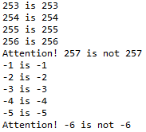
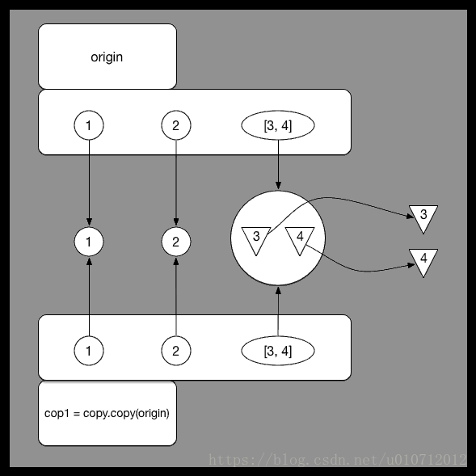
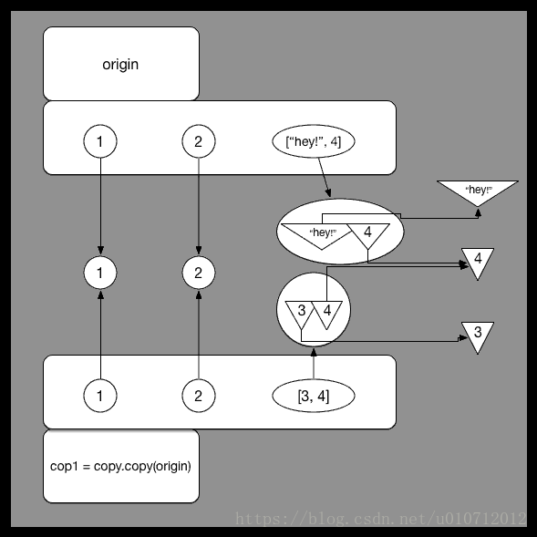
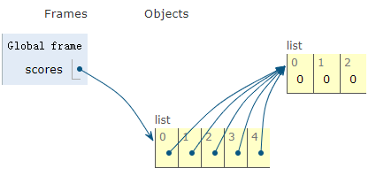
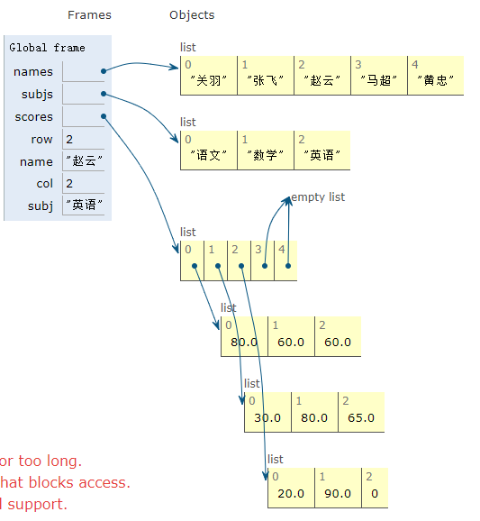

# Python的内存管理机制

## Python中与内存相关的基本概念

### 变量、对象及引用

在python中有一个基础概念：python中的所有东西都是对象。与C++等编译语言不同（把值赋给变量），python中的变量本身是不具有数据类型的，其数据类型由其所指向的对象的类型决定，如下：

```python
a = 1
```

其中`a`被称为变量，而`1`则是对象，`a`的数据类型由`1`决定，即整型`int`，当我们将变量`a`指向另一个数据类型的对象时，`a`的类型也将随着其所指向的对象类型而发生改变。

在 Python 中 `a = something` 应该理解为给 `something` 贴上了一个标签 `a`。当再赋值给 `a` 的时候，就好象把` a` 这个标签从原来的 `something`上拿下来，贴到其他对象上，建立新的引用。
```python
>> a = [1, 2, 3]
>>> b = a
>>> a = [4, 5, 6] //赋新的值给 a
>>> a
[4, 5, 6]
>>> b
[1, 2, 3]
# a 的值改变后，a更换了对象，b 并没有随着 a 变

>>> a = [1, 2, 3]
>>> b = a
>>> a[0], a[1], a[2] = 4, 5, 6 //改变原来 list 中的元素
>>> a
[4, 5, 6]
>>> b
[4, 5, 6]
# a 的值改变后，b 随着 a 变了
```

在python中，对象拥有真正的内存资源与相应的取值，变量只是对象的一个引用。一个变量引用一个对象，而一个对象可以被多个变量引用。正是因为一个对象可以被多个变量引用，所以**只有在某个对象的引用个数为0时，python才会对该对象的内存进行回收**，有点类似于C++中的智能指针的内存回收机制。

### 存储机制

总的来说，python在存储对象时存在**三个存储区域**：

1. 事先分配的静态内存，这一部分内存的大小以及对应的取值固定，需要某个对象时在相应位置取值即可。
2. 事先分配的可重复利用内存，这一部分内存的大小固定，但在需要的时候才对这一部分内存进行赋值，这一部分的内存可以重复利用。
3. 使用`malloc`和`free`管理的自由内存，这一部分的内存是动态申请和释放的。

首先来看整型对象的存储，该类型的存储区域可分为两部分：对小整数`[-5, 256]`事先分配静态内存、对大整数（其他部分）事先分配可重复利用的内存。比如如下的代码：

```python
def main():
	x = y = -1
	while True:
		x += 1
		y += 1
		if x is y:
			print('%d is %d' % (x, y))
		else:
			print('Attention! %d is not %d' % (x, y))
			break
			
	x = y = 0
	while True:
		x -= 1
		y -= 1
		if x is y:
			print('%d is %d' % (x, y))
		else:
			print('Attention! %d is not %d' % (x, y))
			break


if __name__ == '__main__':
	main()
```

其运行结果如下图所示：



出现这一现象的原因便是Python的静态内存机制，当整数的大小位于[-5,256]范围内时，在任何需要引用这些对象的地方，都不再重新创建新的对象，而是直接引用缓存中的对象。而当整数的大小不在这一范围内时，便会新建新的对象，这时即使值是一样的，也属于不同的对象（对应不同的内存地址）。

还有另外一种情况，如下代码所示：

```python
a = 257


def main():
	b = 257  # 第6行
	c = 257  # 第7行
	print(b is c)  # True
	print(a is b)  # False
	print(a is c)  # False


if __name__ == "__main__":
	main()
```

其运行结果如注释所示，看上去`a`、`b`和`c`的值都是一样的，但是`is`运算的结果却不一样。为什么会出现这样的结果，首先需要理解Python程序中的代码块的概念。

> 所谓**代码块**是程序的一个最小的基本执行单位，一个模块文件、一个函数体、一个类、交互式命令中的单行代码都叫做一个代码块。

上面的代码由两个代码块构成，`a = 257`是一个代码块，`main`函数是另外一个代码块。Python内部为了进一步提高性能，凡是在一个代码块中创建的整数对象，如果值不在`small_ints`（[-5,256]）缓存范围之内，但在同一个代码块中已经存在一个值与其相同的整数对象了，那么就直接引用该对象，否则创建一个新的对象出来，**这条规则对不在`small_ints`范围的负数并不适用，对负数值浮点数也不适用，但对非负浮点数和字符串都是适用的**，这一点读者可以自行证明。所以 `b is c`返回了`True`，而`a`和`b`不在同一个代码块中，虽然值都是257，但却是两个不同的对象，`is`运算的结果自然是`False`了。

而对于`string`类型，同样也划分为静态内存和可重复利用内存。

## Python的内存管理机制

在C++语言中，允许我们直接对内存进行管理，这样做的好处在于我们可以很灵活地对内存进行申请释放，缺点在于内存管理较为复杂、容易出错。在Python中，其本质上也是使用`malloc`和`free`等进行内存的管理，但区别在于Python本身完成了对内存的自动管理，有一套完整的内存管理机制，只向程序员提供了少量的接口。

Python的内存管理机制总体上可以划分为两个部分：

### 引用计数机制

引用计数机制的主要作用为：依据对象的被引用次数决定该对象是否应该被释放。

> 针对可以重复利用的内存缓冲区和内存，python使用了一种引用计数的方式来控制和判断某快内存是否已经没有再被使用。即每个对象都有一个计数器count，记住了有多少个变量指向这个对象，当这个对象的引用计数器为0时，假如这个对象在缓冲区内，那么它地址空间不会被释放，而是等待下一次被使用，而非缓冲区的该释放就释放

当出现以下情况时，某一对象的引用个数将增加：

* 对象被创建`p = Person()`，增加1；

* 对象被引用`p1 = p`，增加1；
* 对象被当作参数传入函数`func(object)`，增加2，原因是函数中有两个属性在引用该对象；
* 对象存储到容器对象中`l = [p]`，增加1

当出现以下情况时，某一对象的引用个数将减少：

* 对象的别名被销毁`del p`，减少1；
* 对象的别名被赋予其他对象，减少1；
* 对象离开自己的作用域，如`getrefcount(object)`方法，每次用完后，其对对象的那个引用就会被销毁，减少1；
* 对象从容器对象中删除，或者容器对象被销毁，减少1。

###　垃圾回收机制

垃圾回收机制的主要作用为：用于解决引用计数机制无法释放的循环引用问题，同时提供了手动释放内存的接口。

python提供了`del`方法来删除某个变量，它的作用是让某个对象引用数减少1。当某个对象引用数变为0时并不是直接将它从内存空间中清除掉，而是采用垃圾回收机制`gc`模块，当这些引用数为0的变量规模达到一定规模，就自动启动垃圾回收，将那些引用数为0的对象所占的内存空间释放。

`gc`模块采用了**分代回收**方法，将对象根据存活的时间分为**三代**:

1. 所有新建的对象都是0代，当0代对象经过一次自动垃圾回收，没有被释放的对象会被归入1代，
2. 同理1代归入2代。
3. 每次当0代对象中引用数为0的对象超过700个时，启动一次0代对象扫描垃圾回收;
4. 经过10次的0代回收，就进行一次0代和1代回收;
5. 1代回收次数超过10次，就会进行一次0代、1代和2代回收。而这里的几个值是通过查询`get_threshold()`返回(700,10,10)得到的。此外，`gc`模块还提供了手动回收的函数，即`gc.collect()`。

上述内容参考自[内存管理](https://chenrudan.github.io/blog/2016/04/23/pythonmemorycontrol.html)

而垃圾回收还有一个重要功能是，解决循环引用的问题，通常发生在某个变量`a`引用了自己或者变量`a`与`b`互相引用。考虑引用自己的情况，可以从下面的例子中看到，`a`所指向的内存对象有3个引用，但是实际上只有两个变量，假如把这两个变量都`del`掉，对象引用个数还是1，没有变成0，这种情况下，如果只有引用计数的机制，那么这块没有用的内存会一直无法释放掉。

```python
>>> a = []
>>> b = a
>>> getrefcount(b)
3
>>> a.append(a)
>>> getrefcount(b)
4
>>> del a
>>> getrefcount(b)
3
>>> del b
>>> unreachable = gc.collect()
>>> unreachable
1
```

Python的`gc`模块便可以被用来处理这种情况。

## Python中的拷贝

在Python中，如果直接使用`a=b`的方式，其实是新增了对象的引用，变量`a`和`b`指向同一个对象，因而对两个变量中的任何一个进行修改都会导致原始对象的修改。

为了使用拷贝，我们需要使用`copy`模块，在Python中将拷贝分为浅拷贝（`copy`）和深拷贝（`deepcopy`），对于一般的对象来说，浅拷贝和深拷贝不存在区别。但对于一些较为复杂的对象，例如嵌套的`list`将会产生区别。

当对嵌套`list`使用浅拷贝时，实际上拷贝的时`list`里各个对象的引用，将`list`中各个**对象的引用**存放到了新的内存地址，浅拷贝示意如下：

```python
>>> import copy
>>> origin = [1, 2, [3, 4]]
>>> cop1 = copy.copy(origin)
>>> cop2 = copy.deepcopy(origin)
>>> cop1 == cop2
True
>>> cop1 is cop2
False 
# cop2和cop1处于不同的内存地址，是不同的对象
>>> origin[2][0] = "hey!" 
>>> origin
[1, 2, ['hey!', 4]]
>>> cop1
[1, 2, ['hey!', 4]]
# 浅拷贝拷贝的是list中的各个对象的引用，改变一个会影响另一个
>>> cop2
[1, 2, [3, 4]]
# 深拷贝拷贝的是list中的各个对象的值，改变一个不会影响另一个
```

`copy`对于一个**复杂对象的子对象**并不会完全复制，什么是复杂对象的子对象呢？就比如序列里的嵌套序列，字典里的嵌套序列等都是复杂对象的子对象。对于子对象，python会把它当作一个公共镜像存储起来，所有对他的复制都被当成一个**引用**，所以说当其中一个引用将镜像改变了之后另一个引用使用镜像的时候镜像已经被改变了，如下图所示，子对象指向的是同一个公共镜像。



而对于深拷贝`deepcopy`而言，会将对象中的每一层复制为一个单独的个体，因而复制之后得到的对象和原始对象互不影响，如下图所示，各个子对象指向的是一个独立的个体。



## 嵌套列表的坑

以下内容转自[那些年我们踩过的坑]([https://github.com/jackfrued/Python-100-Days/blob/master/%E9%82%A3%E4%BA%9B%E5%B9%B4%E6%88%91%E4%BB%AC%E8%B8%A9%E8%BF%87%E7%9A%84%E9%82%A3%E4%BA%9B%E5%9D%91.md](https://github.com/jackfrued/Python-100-Days/blob/master/那些年我们踩过的那些坑.md))

Python中有一种内置的数据类型叫列表，它是一种容器，可以用来承载其他的对象（准确的说是其他对象的引用），列表中的对象可以称为列表的元素，很明显我们可以把列表作为列表中的元素，这就是所谓的嵌套列表。嵌套列表可以模拟出现实中的表格、矩阵、2D游戏的地图（如植物大战僵尸的花园）、棋盘（如国际象棋、黑白棋）等。但是在使用嵌套的列表时可能会出现一些问题：

```python
names = ['关羽', '张飞', '赵云', '马超', '黄忠']
subjs = ['语文', '数学', '英语']
scores = [[0] * 3] * 5
for row, name in enumerate(names):
    print('请输入%s的成绩' % name)
    for col, subj in enumerate(subjs):
        scores[row][col] = float(input(subj + ': '))
        print(scores)
```

我们希望录入5个学生3门课程的成绩，于是定义了一个有5个元素的列表，而列表中的每个元素又是一个由3个元素构成的列表，这样一个列表的列表刚好跟一个表格是一致的，相当于有5行3列，接下来我们通过嵌套的for-in循环输入每个学生3门课程的成绩。程序执行完成后我们发现，每个学生3门课程的成绩是一模一样的，而且就是最后录入的那个学生的成绩。

要想把这个坑填平，我们首先要区分对象和对象的引用这两个概念，而要区分这两个概念，还得先说说内存中的栈和堆。我们经常会听人说起“**堆栈**”这个词，但实际上“堆”和“栈”是两个不同的概念。众所周知，一个程序运行时需要占用一些内存空间来存储数据和代码，那么这些内存从逻辑上又可以做进一步的划分。对底层语言（如C语言）有所了解的程序员大都知道，程序中可以使用的内存从逻辑上可以为五个部分，按照地址从高到低依次是：栈（stack）、堆（heap）、数据段（data segment）、只读数据段（static area）和代码段（code segment）。其中，栈用来存储局部、临时变量，以及函数调用时保存现场和恢复现场需要用到的数据，这部分内存在代码块开始执行时自动分配，代码块执行结束时自动释放，通常由编译器自动管理；堆的大小不固定，可以动态的分配和回收，因此如果程序中有大量的数据需要处理，这些数据通常都放在堆上，如果堆空间没有正确的被释放会引发内存泄露的问题，而像Python、Java等编程语言都使用了垃圾回收机制来实现自动化的内存管理（自动回收不再使用的堆空间）。

所以下面的代码中，变量`a`并不是真正的对象，它是对象的引用，相当于记录了对象在堆空间的地址，通过这个地址我们可以访问到对应的对象；同理，变量`b`是列表容器的引用，它引用了堆空间上的列表容器，而列表容器中并没有保存真正的对象，它保存的也仅仅是对象的引用。

```python
a = object()
b = ['apple', 'pitaya', 'grape']
```

知道了这一点，我们可以回过头看看刚才的程序，我们对列表进行`[[0] * 3] * 5`操作时，仅仅是将`[0, 0, 0]`这个列表的地址进行了复制，并没有创建新的列表对象，所以容器中虽然有5个元素，但是这5个元素引用了同一个列表对象，这一点可以通过`id`函数检查`scores[0]`和`scores[1]`的地址得到证实。

```shell
scores[0]: 212a5f1f8c8, scores[1]: 212a5f1f8c8
```

```python
scores = [[0] * 3] * 5
```

这句代码所创建的内存的分布如下图所示：



所以正确的代码应该按照如下的方式进行修改。

```python
names = ['关羽', '张飞', '赵云', '马超', '黄忠']
subjs = ['语文', '数学', '英语']
scores = [[]] * 5
for row, name in enumerate(names):
    print('请输入%s的成绩' % name)
    scores[row] = [0] * 3
    for col, subj in enumerate(subjs):
        scores[row][col] = float(input(subj + ': '))
        print(scores)
```

内存分布方式如下：



在上述代码中，最外层列表的每一个元素所引用的列表都是在运行时重新分配的。

或者：

```python
names = ['关羽', '张飞', '赵云', '马超', '黄忠']
subjs = ['语文', '数学', '英语']
scores = [[0] * 3 for _ in range(5)]
for row, name in enumerate(names):
    print('请输入%s的成绩' % name)
    scores[row] = [0] * 3
    for col, subj in enumerate(subjs):
        scores[row][col] = float(input(subj + ': '))
        print(scores)
```

这一做法其实和上一个做法相同，都是在运行时分配对象内存。

## 参考

* [python中copy()和deepcopy()详解](https://blog.csdn.net/u010712012/article/details/79754132)
* [Python内存管理](https://chenrudan.github.io/blog/2016/04/23/pythonmemorycontrol.html)
* [那些年我们踩过的坑]([https://github.com/jackfrued/Python-100-Days/blob/master/%E9%82%A3%E4%BA%9B%E5%B9%B4%E6%88%91%E4%BB%AC%E8%B8%A9%E8%BF%87%E7%9A%84%E9%82%A3%E4%BA%9B%E5%9D%91.md](https://github.com/jackfrued/Python-100-Days/blob/master/那些年我们踩过的那些坑.md))