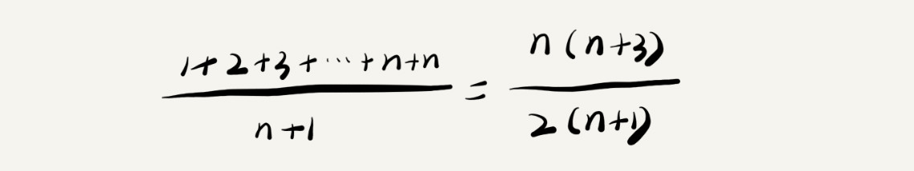

# 最好、最坏、平均和均摊时间复杂度

本文为[数据结构与算法之美-王争](https://time.geekbang.org/column/article/40036)的学习笔记，如需查看完整内容，请参考链接。

## 不同情况下具有不同的时间复杂度

考虑如下代码：

```c
// n 表示数组 array 的长度
int find(int[] array, int n, int x) {
  int i = 0;
  int pos = -1;
  for (; i < n; ++i) {
    if (array[i] == x) {
       pos = i;
       break;
    }
  }
  return pos;
}

```

上述代码的功能是在一个数组中查找指定的元素。对于这一段程序有以下几种情况：

* 所查找的元素位于数组的首位，那么`for`循环中的程序只需运行一次，该算法的时间复杂度为$O(1)$。
* 所查找的元素位于数组的末位或者不存在于数组中，那么`for`循环需要执行n次，该算法的时间复杂度为$O(n)$。
* 所查找的元素既不位于首位也不位于末位，属于一般的情况。

对于这一类的程序，我们无法简单地判定代码地时间复杂度，为了解决这一问题，需要引入**最好情况时间复杂度**、**最坏情况时间复杂度**和**平均情况时间复杂度**的概念。

所谓最好情况时间复杂度，即在最理想的情况下，这段代码的时间复杂度；而相应的最坏情况时间复杂度就是最坏的情况下这段代码的时间复杂度。这两种情况的发生概率都不大，因而我们**重点关注平均情况时间复杂度**。

## 平均情况时间复杂度

对于刚才的程序，假设元素出现在数组中的任何一个位置（0~n-1）和不在数组中这n中情况的概率相同，那么查找次数的期望为：



忽略系数、低阶、常量，得到的平均时间复杂度为$O(n)$。

在上述分析过程中，我们使用了加权平均值，也叫期望值，所以平均情况时间复杂度也可称为**加权平均时间复杂度**。实际上，上述n中情况发生的概率不一定相同，但最终得到的时间复杂度是正确的。

## 均摊时间复杂度

实际上，在一般的算法时间度分析时，我们不需要区分最好、最坏、平均三种复杂度。平均复杂度只在某些特殊情况下才会用到，而均摊时间复杂度应用的场景更为特殊。

以下述代码为例：

```c
 // array 表示一个长度为 n 的数组
 // 代码中的 array.length 就等于 n
 int[] array = new int[n];
 int count = 0;
 
 void insert(int val) {
    if (count == array.length) {
       int sum = 0;
       for (int i = 0; i < array.length; ++i) {
          sum = sum + array[i];
       }
       array[0] = sum;
       count = 1;
    }

    array[count] = val;
    ++count;
 }
```

这段代码实现的功能为向数组中插入元素，当数组满时，对数组中的元素进行遍历求和，将求和结果放到数组的第一个位置，并将要插入的元素放到数组的第二个位置。

在最好的情况下，数组中还有空位，程序只需运行一次，因而时间复杂度为$O(1)$；最坏的情况下，数组已满，则需要执行`for`循环，时间复杂度为$O(n)$。

数组中还有空位的情况共有n种，每一种的时间复杂度都为$O(1)$，除此之外，当数组已满时，时间复杂度为$O(n)$。在插入一个元素时，这$n+1$种情况具有同等的概率，加权平均后得：


因此该算法的平均时间复杂度为$O(1)$。

实际上，上述分析过程偏复杂，`insert()`函数和`find()`函数存在很大的不同：

* `find()`函数在极端情况下时间复杂度为$O(1)$，而`insert()`函数在大多数情况下时间复杂度都是$O(1)$。
* `insert()`函数的$O(1)$和$O(n)$时间复杂度存在一定的次序，一个$O(n)$时间复杂度后紧跟n-1个$O(1)$时间复杂度。

因此，我们不需要像平均时间复杂度分析那样，找出每一种情况的发生概率，再求加权平均。为此，引入一种称为**摊还分析法**的分析方法。

摊还分析法的大体思路如下：在上述插入程序中，一个$O(n)$时间复杂度后紧跟n-1个$O(1)$时间复杂度，因而可以直接将$O(n)$时间复杂度平摊到后续的n-1个耗时少的操作上，这样一组连续的操作的均摊时间复杂度就是$O(1)$。

均摊分析法适用于以下场景：在对一个数据结构进行一系列操作时，大部分情况下时间复杂度都很低，只有个别情况下时间复杂度比较高，并且，这些操作之间通常存在前后连贯的操作关系。因而，可以将这一系列的操作放在一起进行分析，看是否可以将耗时高的操作的耗时均摊到耗时低的操作上。

一般能应用均摊时间复杂度的场合，均摊时间复杂度就等于最好情况时间复杂度。

## 实例

一段算法如下：

```c
// 全局变量，大小为 10 的数组 array，长度 len，下标 i。
int array[] = new int[10]; 
int len = 10;
int i = 0;

// 往数组中添加一个元素
void add(int element) {
   if (i >= len) { // 数组空间不够了
     // 重新申请一个 2 倍大小的数组空间
     int new_array[] = new int[len*2];
     // 把原来 array 数组中的数据依次 copy 到 new_array
     for (int j = 0; j < len; ++j) {
       new_array[j] = array[j];
     }
     // new_array 复制给 array，array 现在大小就是 2 倍 len 了
     array = new_array;
     len = 2 * len;
   }
   // 将 element 放到下标为 i 的位置，下标 i 加一
   array[i] = element;
   ++i;
}
```

在这段往数组中添加元素的代码中

* 最好的情况是数组空间充足，那么时间复杂度为$O(1)$；

* 最坏的情况是，数组已满，那么需要对数组进行拷贝，此时数组的大小会增加一倍，假设某次添加前数组的大小为n（因为数组是变长的，所以只能假设），那么时间复杂度为$O(n)$；

* 平均：添加元素之前数组未满，此种情况有n（剩余n个空位）种，时间复杂度都是$O(1)$；数组已满，时间复杂度为$O(n)$，在添加元素之前，这n+1种情况的概率是相同的，因而平均时间复杂度为$O(1)$。
  $$
  \frac{1}{n+1}O(1)+\frac{1}{n+1}O(1)+...+\frac{1}{n+1}O(1)+\frac{1}{n+1}O(n)=\frac{n}{n+1}O(1)+\frac{1}{n+1}O(n)=O(1)
  $$

* 对于均摊时间复杂度，每数组复制之后都会接着n次耗时少的插入，因而均摊时间复杂度为$O(1)$。

## 参考

* [数据结构与算法之美](https://time.geekbang.org/column/article/40447)