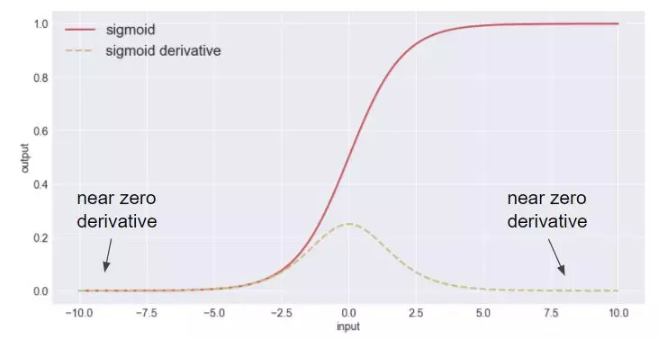
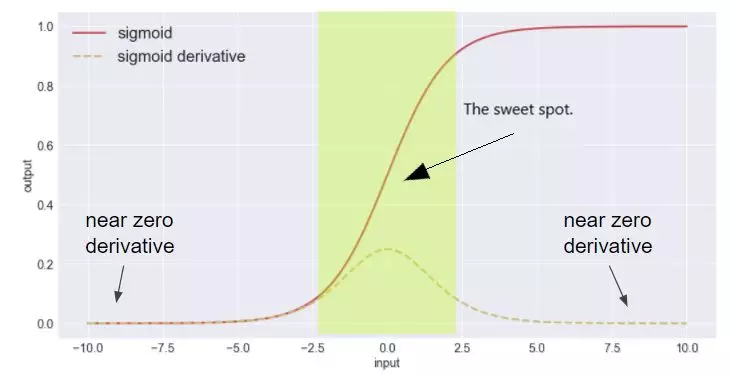
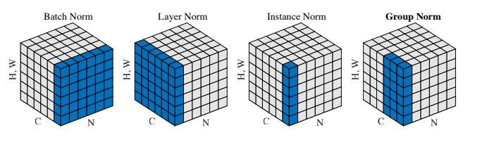

# 神经网络中的归一化操作

## 内部协变量偏移（Internal Covariate Shift）

在介绍归一化操作之前，我们需要了解什么是内部协变量偏移。首先，协变量偏移是数据分布不一致性的一种表现。已知贝叶斯公式：
$$
p(\mathbf{x}, y)=p(\mathbf{x} | y) p(y)=p(y | \mathbf{x}) p(\mathbf{x})
$$
所谓协变量偏移指的是：源领域和目标领域的输入边际分布不同$p_{S}(\mathbf{x}) \neq p_{T}(\mathbf{x})$，但两者的后验分布相同$p_{S}(y | \mathbf{x})=p_{T}(y | \mathbf{x})$，即学习任务相同。

而在深度神经网络中，中间某一层的输入是其之前的神经层的输出。因此，其之前的神经层的参数变化会导致其输入的分布发生较大的差异。在使用随机梯 度下降来训练网络时，每次参数更新都会导致网络中间每一层的输入的分布发 生改变。越深的层，其输入的分布会改变得越明显。就像一栋高楼，低楼层发生一个较小的偏移，都会导致高楼层较大的偏移。

从机器学习的角度来看，如果某一层网络的输入的分布发生了变化，那么其参数就需要重新学习，我们将这种现象称为内部协变量偏移。归一化便是一种被用来解决内部协变量偏移的方法。归一化方法的引入可以使得每一个神经层的输入的分布在训练过程中保持一致。

## 梯度弥散问题

所谓梯度弥散，指的是，梯度在反向传播过程中由于网络太深或者网络激活值位于激活函数的饱和区而消失，深层的梯度无法顺利传播到神经网络的浅层，进而导致神经网络无法正常训练。

如上图常用的sigmoid激活函数，虚线为导数。可以看出，当函数输入位于饱和区时，梯度将保持为0。那么如何解决这一现象呢？一种做法是在网络的结构上做文章，例如ResNet中引入了跨层连接，梯度可以通过跨层连接传入底层网络层；另一种做法就是将激活函数的输入限制在非饱和区。

通过使用归一化操作便可以达到这一目的。对网络层的输入进行归一化后，输入的数值便被限制在较小的区间进而保证了输入不会进入激活函数的饱和区。

以下为几种常用的逐层归一化方法，所谓逐层归一化指的是可以被应用在深度神经网络的任何一个中间层。**在实际应用中，并不需要对所有的网络层进行归一化**。

## 批量归一化（Batch Normalization, BN）

批量归一化方法由$[Ioffe \ and\ Szegedy, 2015]$提出，是一种有效的逐层归一化方法。对于一个深层神经网络，令第$l$层的净输入为$z^{(l)}$，神经元的输出为$a^{l}$，即：
$$
\mathbf{a}^{(l)}=f\left(\mathbf{z}^{(l)}\right)=f\left(W \mathbf{a}^{(l-1)}+\mathbf{b}\right)
$$
其中$f()$是激活函数，$W$和$b$为可学习参数。

为了解决内部协变量偏移问题，就要使得网络层的净输入$z{(l)}$的分布一致。在实际应用中，归一化操作常应用在仿射变换之后，激活函数之前，这么做的原因在于输入的分布性质不如净输入稳定。

逐层归一化需要在中间层进行，因而需要有较高的效率，不适合使用复杂度较高的归一化方法，一般使用标准归一化方法，将净输入$z{(l)}$的**每一个维度**都归一化到标准正态分布。
$$
\hat{\mathbf{z}}^{(l)}=\frac{\mathbf{z}^{(l)}-\mathbb{E}\left[\mathbf{z}^{(l)}\right]}{\sqrt{\operatorname{var}\left(\mathbf{z}^{(l)}\right)+\epsilon}}
$$
其中的均值$\mathbb{E}\left[\mathbf{z}^{(l)}\right]$和方差$var(z^{(l)})$是在当前网络参数下，$z^{(l)}$的每一维在整个训练集上的期望和方差。但实际上，我们是无法计算整个数据集上的统计量的，**只能使用当前小批量数据集的均值和方差进行估计**。给定包含$K$个样本的小批量样本集合，计算第$l$层神经元的净输入$z^{(1,l)},...,z^{(K,l)}$的均值和方差：
$$
\begin{aligned} \mu_{\mathcal{B}} &=\frac{1}{K} \sum_{k=1}^{K} \mathbf{z}^{(k, l)} \end{aligned}
$$
$$
\sigma_{\mathcal{B}}^{2} =\frac{1}{K} \sum_{k=1}^{K}\left(\mathbf{z}^{(k, l)}-\mu_{\mathcal{B}}\right) \odot\left(\mathbf{z}^{(k, l)}-\mu_{\mathcal{B}}\right)
$$

但是，直接将网络层的净输入归一化到$[-1,1]$区间会使得激活函数的取值区间限制在线性变换区间内，减弱了神经网络的非线性性质。因此，为了使得归一化不对网络的表示能力造成负面影响，可以通过一个附加的缩放和平移变换改变取值区间。
$$
\begin{aligned} \hat{\mathbf{z}}^{(l)} &=\frac{\mathbf{z}^{(l)}-\mu_{\mathcal{B}}}{\sqrt{\sigma_{\mathcal{B}}^{2}+\epsilon}} \odot \gamma+\beta \\ & \triangleq \mathrm{BN}_{\gamma, \beta}\left(\mathbf{z}^{(l)}\right) \end{aligned}
$$
其中$\gamma$和$\beta$分别表示缩放因子和平移因子。在实际应用中，这两个参数常被设置为可学习参数。

我们可以将批量归一化层看作一个特殊的神经层，加载每一层非线性激活函数之前：
$$
\mathbf{a}^{(l)}=f \left(\mathrm{BN}_{\gamma, \beta}\left(\mathbf{z}^{(l)}\right)\right)
$$

$$
\mathbf{z^{(l)}}=f\left(\mathrm{BN}_{\gamma, \beta} \left(W \mathbf{a}^{(l-1)}\right)\right)
$$

这里有一个很重要的性质:

> 因为批量归一化层本身有平移变化参数，因而仿射变化可以不加偏置参数。

### 实际计算细节

各种归一化方法的区别在于，按照特征图的哪一个维度计算均值和方差。

#### 批量归一化（Batch Normalization, BN）

在卷积神经网络中，设一个层的特征图的大小为$x\in R^{N\times C \times H \times W}$，包含$N$个样本，每个样本有$C$个通道、高为$H$、宽为$W$。现在，我们要对该特征图求均值和方差，**计算方式为按照通道$C$分别计算各个通道的均值和方差**，计算完成后对于该层特征图，将得到$C$个均值和$C$个方差。
$$
\begin{array}{c}{\mu_{c}(x)=\frac{1}{N H W} \sum_{n=1}^{N} \sum_{h=1}^{H} \sum_{w=1}^{W} x_{n c h w}}\end{array}
$$
$$
{\sigma_{c}(x)=\sqrt{\frac{1}{N H W} \sum_{n=1}^{N} \sum_{h=1}^{H} \sum_{w=1}^{W}\left(x_{n c h w}-\mu_{c}(x)\right)^{2}+\epsilon}}
$$

表示如下图所示：

正如上图中的Batch Norm所示，**通道之间独立计算**是批量归一化的核心。

#### 层归一化（Layer Normalization, LN）

正如上一小节所述，每一个通道的均值和方差需要使用mini-batch中的所有样本的对应通道的值计算得到，当batch-size较小时，各个通道的均值和方差的偏差将比较大。且当训练样本的大小不同（例如RNN模型）时，无法进行合理计算。为了解决这一问题，提出了层归一化方法。

所谓层归一化，即**按照样本数$N$分别计算各个样本的均值和方差**，计算完成后，对于该层特征图将得到$N$个均值和$N$个方差。
$$
\begin{array}{c}{\mu_{n}(x)=\frac{1}{C H W} \sum_{c=1}^{C} \sum_{h=1}^{H} \sum_{w=1}^{W} x_{n c h w}}\end{array}
$$
$$
 {\sigma_{n}(x)=\sqrt{\frac{1}{C H W} \sum_{c=1}^{C} \sum_{h=1}^{H} \sum_{w=1}^{W}\left(x_{n c h w}-\mu_{n}(x)\right)^{2}+\epsilon}}
$$

同样参考之前的示意图，**样本之间独立计算**是层归一化的核心。

#### 实例归一化（Instance Normalization, IN）

所谓实例归一化，即按照单个样本的单个通道进行计算，计算对象为单层特征图的$N \times W$个值，最终将分别得到$N\times C$个均值和方差。
$$
\begin{array}{c}{\mu_{n c}(x)=\frac{1}{H W} \sum_{h=1}^{H} \sum_{w=1}^{W} x_{n c h w}}\end{array}
$$
$$
{\sigma_{n c}(x)=\sqrt{\frac{1}{H W} \sum_{h=1}^{H} \sum_{w=1}^{W}\left(x_{n c h w}-\mu_{n c}(x)\right)^{2}+\epsilon}}
$$

同样参考之前的示意图，**所有样本的各个通道之间独立计算**是实例归一化的核心。

#### 分组归一化（Group Normalization, GN）

分组归一化适用于需要大量显存的任务，对于一些任务，我们无法设置较大的batch size，因而无法使用批量归一化。为了缓和这一问题，提出了分组归一化，这里的分组对象是单个样本的通道。

在计算均值和方差时，将每一个样本的特征图的通道划分为$G$组，每组将有$C/G$个通道，将各个通道组内的元素求均值和方差，作为通道组内各个通道的均值和方差，最终将得到$N\times G$个均值和方差。
$$
\begin{array}{c}{\mu_{n g}(x)=\frac{1}{(C/G)H W} \sum_{C=gC/G}^{(g+1)C/G} \sum_{h=1}^{H}\sum_{w=1}^{W} x_{n c h w}}\end{array}
$$

$$
{\sigma_{n g}(x)=\sqrt{\frac{1}{(C/G)H W} \sum_{c=gC/G}^{(g+1)C/G} \sum_{h=1}{H}\sum_{w=1}^{W}\left(x_{n c h w}-\mu_{n g}(x)\right)^{2}+\epsilon}}
$$

可以将分组归一化看作层归一化和实例归一化的中间状态，分组为1时就是层归一化，分组为通道数$C$时就是实例归一化。

分组归一化的核心就是，**单个样本的不同通道组之间**独立计算。

总的来说，使用不同的计算对象便可以得到不同的归一化方式。

## 参考

* [如何区分并记住常见的几种 Normalization 算法](https://zhuanlan.zhihu.com/p/69659844)

