# 神经网络的优化

我们在使用神经网络时会面临一些难点，这些难点主要可分为以下两大类：

1. 优化问题：神经网络模型是一个非凸函数，再加上在深度网络中的梯度消失问题，很难进行优化；另外，深层神经网络模型一般参数比较多，训练数据也比较大，会导致训练的效率比较低 。
2. 泛化问题：神经网络具有很强的拟合能力，因而很容易在训练集上产生过拟合。在训练神经网络时，需要采取一定的正则化方法来改进网络的泛化能力。

## 网络优化

在对神经网络进行优化时存在一些难点，主要有以下几点：

* **网络结构多样**

  神经网络具有非常多样的结构，我们无法找到一种通用的优化方法来解决所有网络上的参数优化问题。

* **高维变量非凸优化**

  在低维优化问题中，要解决的问题主要是如何逃离局部最优值。而在高维空间中，所面临的是另一种问题，即如何逃离**鞍点**（Saddle Point）。鞍点处的的梯度为0，但在一些维度上是最高点、在另一些维度上是最低点，如图所示：

  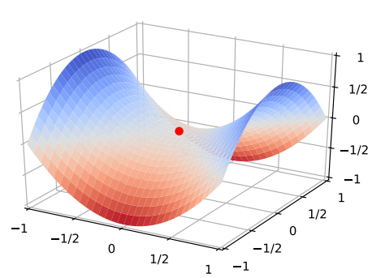

  在高维空间中，大部分梯度为0的点都是鞍点。基于梯度下降的优化方法在鞍点附近会处于停滞状态，很难从这些鞍点逃离。

* **平坦的底部**

  神经网络的参数非常多，且参数之间存在一定的冗余性，因而每一个参数对于最终的损失的影响都非常小，损失函数在局部最优点附近表现为一个平坦的区域，称为**平坦最小值**。

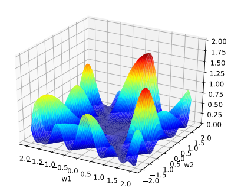

目前，神经网络所使用的参数优化方法主要是基于梯度下降来寻找一组可以最小化结构风险的参数。可以将梯度下降法分为：

* 随机梯度下降（每次只使用一个样本进行梯度计算）
* 批量梯度下降（每次使用所有的样本进行梯度计算）
* 小批量梯度下降（每次使用小批量的样本进行梯度计算）

## 小批量梯度下降（mini-batch）

影响小批量梯度下降算法的因素主要有三个：**学习率**、**小批量的大小**以及**参数更新方向**。

* **批量大小的选择**

  批量大小一般不会影响随机梯度的期望，但对随机梯度的方差有较大影响。批量大小越大，随机梯度的方差越小，引入的噪声也越小，训练也越稳定，因此可以设置较大的学习率。反之，当批量大小越小时，需要设置较小的学习率，否则模型会不收敛。

  学习率通常要随着批量大小的增加而相应的增大，一个常用的方法是**线性缩放规则**，即学习率和批量大小以同等的倍数增大。要注意的是，线性缩放规则在批量大小较小时适用，当批量大小非常大时，线性缩放会使得训练不稳定。

* **学习率调整**

  学习率的调整非常重要，过大导致训练不收敛，过小导致训练收敛缓慢。常用的学习率调整方法包括学习率衰减、学习率预热、周期学习率和自适应学习率调整方法等。

  常见的**学习率衰减方法**有：

  1. **分段常数衰减**（Piecewise Constant Decay）：每经过$T_1,T_2,...T_m$次训练迭代，分别将学习率衰减为原来的$\beta_1, \beta_2,...,\beta_m$倍，也称为步衰减（Step Decay）。

  2. **逆时衰减**（Inverse Time Decay）：
     $$
     \alpha_{t}=\alpha_{0} \frac{1}{1+\beta \times t}
     $$

  3. **指数衰减**（Exponential Decay）：
     $$
     \alpha_{t}=\alpha_{0} \beta^{t},\ \ \ \beta<1
     $$

  4. **自然指数衰减**（Natural Exponential Decay）：
     $$
     \alpha_{t}=\alpha_{0} \beta^{t}
     $$

  5. **余弦衰减**（Cosine Decay）：
     $$
     \alpha_{t}=\alpha_{0} \exp (-\beta \times t)
     $$
  
  不同的学习率衰减方法的示意图如下所示：

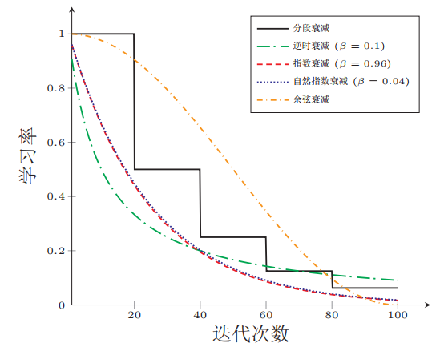

​	除了使用学习率衰减方法之外，在训练的开始阶段常用的学习率调整方法还有**学习率预热**：

​	使用学习率预热的原因在于，在一开始时由于网络的参数是随机初始化的，因而梯度也比较大，这时候如果同	时采用较大的初始学习率会导致训练不稳定。因而我们可以在开始的几轮迭代中使用较小的学习率进行预热，	当梯度下降到一定梯度时再恢复初始学习率。

​	在学习率调整方法中，一种常用的方法还有周期性学习率调整：为了使得梯度下降方法能够逃离局部最小点，	一种经验性的方式是在训练过程中周期性地增大学习率。增加学习率短期内会损害网络的收敛稳定性，但从长	期来看有助于找到更好的局部最优解。主要有两种周期性学习率调整方法：循环学习率、带热重启的随机梯度	下降。所谓循环学习率即让学习率在一个区间内周期性地增大和缩小，每个周期的学习率的上界和下界可以随	着循环周期数的增大而减小：

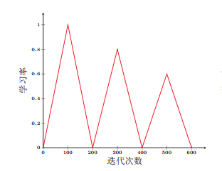

​	所谓带热重启的随机梯度下降指的是：学习率每隔一定周期后重新初始化为某个预设值，然后逐渐衰减，每次	重启后模型参数不是从头开始优化，而是从重启前的参数基础上继续优化：

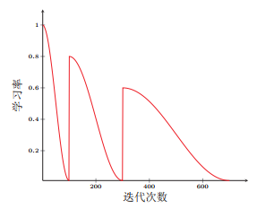

除了上述的学习率调整方法之外，还有一些自适应的学习率调整方法。

### 自适应学习率调整

在自适应学习率调整中，调整对象为各个参数各自的学习率。

#### AdaGrad算法

在标准的梯度下降算法中，每个参数在每次迭代时都使用相同的学习率。但实际上，对于每个参数来说，在每一迭代中是具有不同的梯度的，因而统一采用相同的学习率并不合适。自适应学习率调整方法便是被用来解决这一问题的。

AdaGrad（Adaptive Gradient）算法[Duchi et al.，2011]借鉴$l_2$正则化思想，**在每次迭代时自适应地调整每个参数的学习率**：

1. 在第$t$次迭代时，首先计算每一个参数各自的梯度平方的累积和：
   $$
   G_{t}=\sum_{\tau=1}^{t} g_{\tau} \odot g_{\tau}
   $$

2. 接着，依据各个参数各自的梯度平方累计和的大小计算当前迭代所使用的梯度：
   $$
   \Delta \theta_t=-\frac{\alpha}{\sqrt{G_t+\epsilon}}\odot g_t
   $$

在AdaGrad算法中，如果某个参数的偏导数累计比较大，其学习率相对较小；相反，如果其偏导数较小，其学习率相对较大。但整体上，各个参数的学习率随着迭代次数的增加而逐渐减小。

该算法的缺点是，在经过一定次数的迭代后，如果仍旧没有找到最优点，由于此时的学习率非常小，很难再继续找到最优点。

#### RMSprop算法

该算法由Geoff Hinton提出，可以在有些情况下避免AdaGrad算法中学习率不断单调下降以至于过早衰减的缺点。该算法中首先计算每次迭代梯度$g_t$平方的指数衰减移动平均：

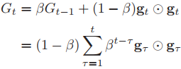

其中$\beta$为衰减率，一般取值为0.9。

参数的更新差值为：

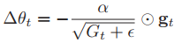

该算法与AdaGrad的区别在于，$G_t$的计算方式由平方累计和变为了指数衰减移动平均。

#### AdaDelta算法

该算法也属于AdaGrad算法的一个改进，该算法除了使用梯度的指数衰减移动平均来调整学习率之外，还引入了每次参数更新的差值$\Delta \theta$的指数衰减移动平均。

在第$t$次迭代时，每次参数更新差$\Delta \theta_\tau$，$1\leq \tau \geq t-1$的平方的指数衰减权移动平均为：
$$
\Delta X_{t-1}^2=\beta_1\Delta X_{t-2}^2+(1-\beta_1)\Delta \theta_{t-1} \odot \Delta \theta_{t-1}
$$
其中$\beta_1$为衰减率。在此基础上，参数的更新差值为：
$$
\Delta \theta_t=-\frac{\sqrt{\Delta X_{t-1}^2}+\epsilon}{\sqrt{G_t}+\epsilon}g_t
$$
AdaDelta算法将RMSprop算法中的初始学习率改为动态计算，在一定程度上抑制了学习率的波动。

### 更新方向的优化

除了对学习率进行优化之外，我们还可以对参数的更新方向即梯度进行优化。为了缓解在样本数量较少时所导致的梯度震荡问题，可以使用最近一段时间的平均梯度来替代当前时刻的梯度，并提高优化速度，即**动量法**。

#### 动量法

所谓动量，指的是物理中一个物体在其运动方向上保持运动的趋势，是物体的质量和速度的乘积。所谓动量法（Momentum Method）是用之前积累动量来替代真正的梯度，每次迭代的梯度可以看作加速度。

在第t次迭代时，计算**负梯度**的“加权移动平均”作为当前参数的更新方向：
$$
\Delta\theta_t=\rho\Delta\theta_{t-1}-\alpha g_t=-\alpha \sum_\tau^t\rho^{t-\tau}g_{\tau}
$$
这样，每个参数的实际更新差值取决于最近一段时间内梯度的加权平均值。当某个参数在最近一段时间内的梯度方向不一致时，其真实的参数更新幅度变小；相反，当在最近一段时间内的梯度方向都一致时，其真实的参数更新幅度变大，起到加速作用。一般而言，在迭代初期，梯度方向都比较一致，动量法会起到加速作用，可以更快地到达最优点。在迭代后期，梯度方向会不一致，在收敛值附近震荡，动量法会起到减速作用，增加稳定性。

#### Nesterov加速梯度

Nesterov加速梯度法是对动量法的一种改进，在动量法中，实际的参数更新方向$\Delta\theta_t$可以被拆分为两步，第一步是先根据$\Delta\theta_{t-1}$更新一次得到参数$\hat \theta$，再使用$g_t$进行更新：

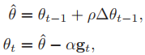

在第二步更新中，梯度$g_t$为$\theta_{t-1}$上的梯度，按照梯度下降法来说，应该是$\hat \theta$上的梯度。依照这种思路，合并后的更新方向为：

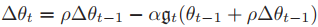

Nesterov加速梯度与动量法在参数更新方向上的比较：

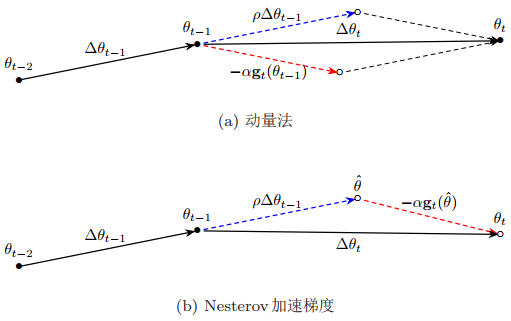

#### Adam算法

自适应动量估计（Adaptive Moment Estimation, Adam）算法可以看作动量法和RMSprop学习率更新算法的结合，在**使用动量作为参数更新方向**的同时，**对学习率进行自适应调整**。

Adam算法一方面计算梯度平方的指数加权平均，另一方面计算梯度的指数加权平均：

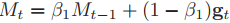

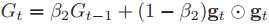

其中$\beta_1,\beta_2$为两个指数加权平均的衰减率，通常取值为$\beta_1=0.9,\beta_2=0.99$。

梯度的指数加权平均$M_t$可以被看作梯度的均值（一阶矩），梯度的平方的指数加权平均可以被看作梯度的未减去均值的方差（二阶矩）。

假设$M_0=0,G_0=0$，那么在迭代初期两者的值会比真实的均值和方差要小。特别是当两个衰减率接近于1时，偏差会很大，因而需要对偏差进行修正：

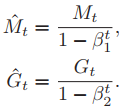

最终，Adam算法的参数更新值为：

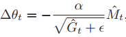

其中，学习率通常设置为0.001，也可以进行衰减。

既然，Adam算法是RMSprop算法和动量法的结合，那么自然也可以将RMSprop算法和Nesterov加速度算法进行结合，即Nadam算法。

### 梯度截断

在深度神经网络的训练过程中，除了梯度消失之外，梯度爆炸是影响学习效率的主要因素。在梯度下降算法中，如果梯度突然增大，将导致模型远离最优点。因而，当梯度大于一定值时，需要对梯度进行截断，即梯度阶段（gradient clipping）。

梯度截断一般有以下两种方法：

* 按值截断

  将参数的梯度限制在一个区间内，按照区间的端点进行截断。

* 按模截断

  将参数的梯度的模值限制在一个给定的阈值下，当参数的梯度的模值小于该阈值时，梯度保持不变，大于该阈值时，令：

  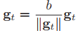

## 总结

总的来说，可以将优化算法划分为两类：一类是调整学习率；另一类是调整参数优化方向。总结为公式如下：

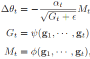

其中，$g_t$为第$t$步的梯度，$\alpha_t$为第$t$步的学习率，可以衰减也可以不变。依据参数优化方向和学习率调整方法的不同，可以将优化方法划分为下表所示：

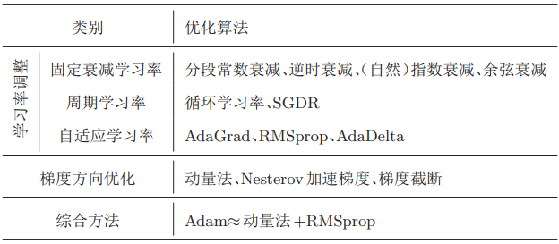

## 参考

* [邱锡鹏-《神经网络与深度学习》](https://github.com/nndl/nndl.github.io)

