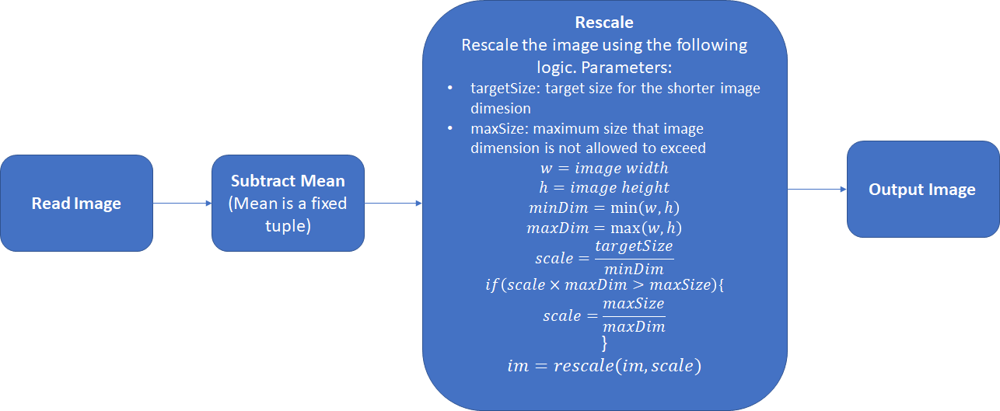
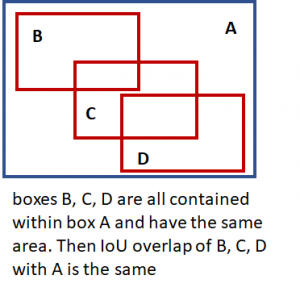
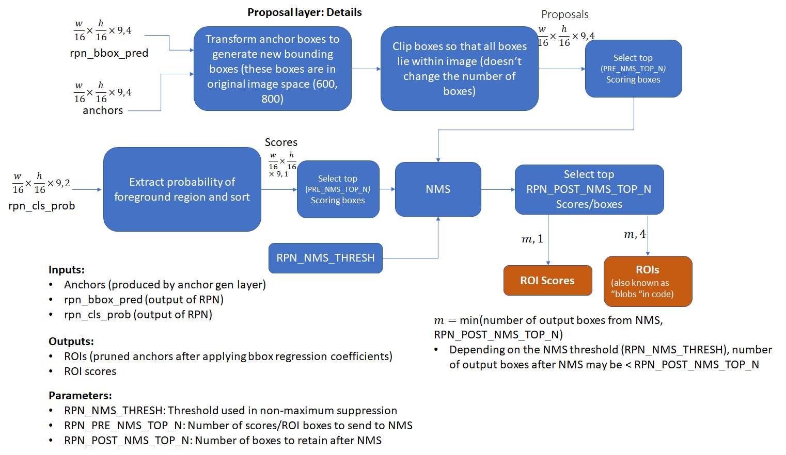
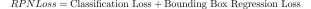
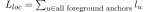
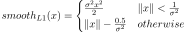
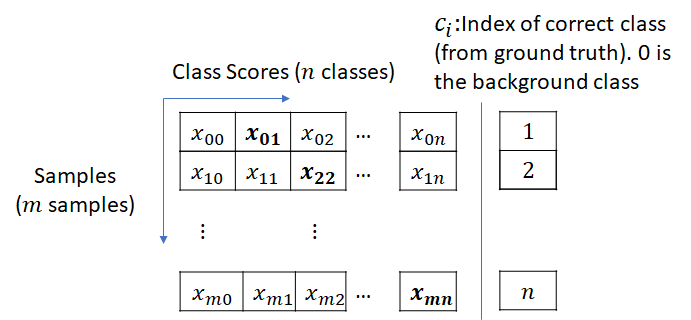
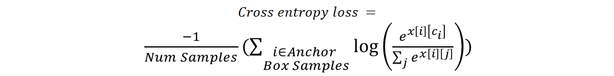
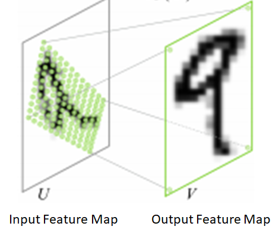
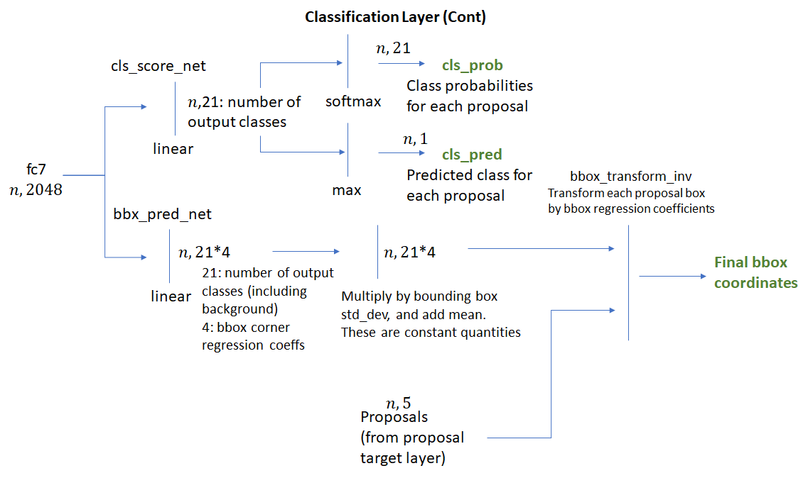

## Faster R-CNN具体实现详解

本文翻译自：[原文](http://www.telesens.co/2018/03/11/object-detection-and-classification-using-r-cnns/)


### 图像预处理
在将图片送入网络之前首先执行如下的网络预处理步骤。在训练和前向传播过程中，以下步骤必须一致。均值向量（大小$1*3$，每一个图像通道一个均值）并非当前图像像素值的均值，而是针对所有训练和测试图片所设置的一个统一的初始值。图像预处理流程如下：



$tatgetSize$和$maxSize$分别为600，1000.

#### 网络组织
R-CNN使用神经网络主要解决如下两个问题：
1. 识别输入图片中可能包含前景目标的区域（Region of Interest - RoI）。
2. 计算每一个RoI中的类别概率分布-例如，计算RoI中包含特定类别的目标的概率，在此基础上，可以选择具有最高概率的类别作为分类结果。

R-CNN主要包含三种类型的神经网络：
1. Head
2. 区域建议网络（Region Proposal Network, RPN）
3. 分类网络

R-CNN使用预训练网络（例如ResNet）的前几层从输入图片中提取特征，这一做法由迁移学习理论作为支持（将在一个数据集上训练得到的网络用于不同的问题是可能的）。网络的前几层检测一些通用的特征（如，边、颜色块等在不同的问题中都具有较好的区分性的特征）,而后几层学习到的更多是与特定问题相关的高层特征。在我们搭建的网路中，可以直接将后面几层移除或者在反向传播过程中对其参数进行更新。这些从预训练的网络的前几层迁移过来的层构成了"head"网络。

由"head"网络产生的卷积特征图将被送入RPN网络中，RPN网络使用一系列的卷积层和全连接层产生可能存在前景目标的RoI区域。接着将使用这些RoI区域从"head"网络产生的特征图中裁剪出相应的特征图区域，称为“crop pooling”.由裁剪池化得到的特征图区域将被送入分类网络，进而经过学习得到该RoI区域所包含的目标种类。

另一方面，ResNet的权重也可以使用如下方式进行初始化：
```python
n = m.kernel_size[0] * m.kernel_size[1] * m.out_channels
m.weight.data.normal_(0, math.sqrt(2. / n))
```

### 网络结构
下图分别展示了上述几种不同的网络模块，图中给出了每一层网络输出和输入特征的大小，这将有助于理解网络中的特征是如何进行转换的，$w,h$表示经过预测后的图片的大小。


### 实现细节：训练
在本节将详细介绍训练R-CNN所涉及到的步骤。一旦理解了训练的流程，理解推理过程将很容易，因为推理只用到了训练过程的一个子集。训练的目标是调整RPN、分类网络以及Head的权重。RPN的任务是产生RoIs区域，分类网络的任务是对每一个RoI给定一个类别分数。为了训练这些网络，我们需要得到相应的ground truths（即图片中所出现的目标的bounding boxes的坐标以及这些目标的类别）。这些信息已经由数据集的标定文件给出，这里有一些常用的通用数据集：

1. PASCAL VOC: The [VOC 2007 ](http://host.robots.ox.ac.uk/pascal/VOC/voc2007/index.html)database contains 9963 training/validation/test images with 24,640 annotations for 20 object classes.
    *   _Person:_ person
    *   _Animal:_ bird, cat, cow, dog, horse, sheep
    *   _Vehicle:_ aeroplane, bicycle, boat, bus, car, motorbike, train
    *   _Indoor:_ bottle, chair, dining table, potted plant, sofa, tv/monitor
    如下图：


2. COCO (Common Objects in Context): The [COCO](http://cocodataset.org/#home) dataset is much larger. It contains > 200K labelled images with 90 object categories.

在本次实现中，使用VOC2007数据集。

下面介绍两个常用概念:
1. **Bounding Boxes Regression Coefficients**(也称为regression coefficients或regression targets)
R-CNN的目标之一就是产生与目标边界尽可能匹配的bounding boxes。R-CNN通过使用回归系数对给定的bounding boxes（给定左上角坐标、宽、高）进行调整来得到匹配的bounding boxes。回归系数由如下方式得出：
分别将目标bounding boxes和原始bounding boxes的左上角坐标表示为：$T_x, T_y, O_x, O_y$，width/height表示为$T_w, T_h, O_w, O_h$。那么回归目标（将原始boxes转换为目标boxes的方程的系数）计算如下：

$$
t _ { x } = \frac { \left( T _ { x } - O _ { x } \right) } { O _ { w } } , t _ { y } = \frac { \left( T _ { y } - O _ { y } \right) } { O _ { h } } , t _ { w } = \log \left( \frac { T _ { w } } { O _ { w } } \right) , t _ { h } = \log \left( \frac { T _ { h } } { O _ { h } } \right)
$$


上述方程是可翻转的，给定回归系数以及原始boxes的左上角坐标、宽和高，便可以计算得到目标boxes的左上角坐标、宽和高。这一系数对无切仿射变换具有不变性，这一性质在计算分类损失时非常重要。因为目标的回归系数在原始比例的图片上计算得到的，而分类网络输出的回归系数是在由RoI池化所得到的正方形特征图上计算得到的。


2. **Intersection over Union (IoU) Overlap**
    我们需要一种度量给定得bounding boxes与另一bounding boxes得接近程度（与所使用的度量bounding boxes大小的单位无关）。这一度量方法需要满足，当两个bounding boxes完全重合时，结果为1，当两个bounding boxes完全不重合时，结果为0,同时要易于计算。常用的度量方式为交并比，计算方式如下所示：

  

  

有了以上概念之后，可以将训练过程划分为以下模块。一个封装了一系列逻辑步骤（例如，数据的流通）的层以及其他步骤，如，bounding boxes重合度的比较，执行nms等。
* **Anchors生成层**
**这一层生成固定数目的anchors**。首先生成9个具有不同尺度、比例的anchors，接着将这9个anchors复制给输入图片上的每一个经过归一化的格子处（每一个格子都包含9个具有不同尺度、比例的anchors，格子的个数由输入图片大小和网络尺度缩小的stride决定）。

* **Proposal Layer**
在anchors生成层产生的anchors的基础上，依据bounding boxes回归系数来产生经过转化的anchors。然后以每一个anchor属于前景目标的分数为依据，对anchors进行非极大抑制，以对anchors的数目进行进一步的微调。

* **Anchor Target Layer**
**Anchor Target Layer**的目的是产生一些好的anchors以及相对应的前景/背景类标、目标回归系数，以用于RPN的训练。该层的输出仅用于训练RPN，不用于分类层的训练。给定由anchors生成层生成的anchors，anchors target层将对前景/背景目标进行识别，其中与真实标定的重合率高于设定阈值的anchors将被识别为前景目标；与真实标定的重合率低于某一阈值的anchors将被识别为背景目标。

* **RPN Loss**
RPN损失函数将在训练RPN网络是被最小化。由以下两部分构成：
    1. RPN所产生的bounding boxes中被正确划分为前景/背景的比例。
    2. 预测的bounding boxe与目标bounding boxes的回归系数的差距。

* **Proposal Target Layer**
对Proposal Layer产生的anchor进行微调，同时产生类别相关的bounding boxes回归目标，这些目标用于对分类网络进行训练，以得到好类别以及目标回归系数。

* **ROI Pooling Layer**
依据proposal target layer产生的建议区域的bounding boxes坐标，使用空间转换网络对输入特征图进行采样，这些坐标一般不会位于整型边界，因而需要进行插值采样。

* **Classification Layer**
分类层以ROI池化层的输出作为输入，将其通过一系列的卷积层后，送入两层全连接层，第一层对于每一个建议区域分别产生类别概率分布；第二层产生类别相关的回归系数。

* **Classification Loss**
与RPN损失相似，在训练分类层时会最小化分类误差。在反向传播的过程中，误差的梯度同样会流入RPN网络，所以对分类层进行训练时同样也会修改RPN网络的权重。分类误差由以下部分构成：
    1. 由RPN产生的建议区域被正确分类的比例。
    2. 预测的回归系数与目标回归系数之间的差距。

下面将详细介绍每一层：
#### Anchor Generation Layer
针对整幅输入图像，产生一系列的具有不同尺度和比例的bounding boxes，即anchor boxes。对于所有图片来说，产生的anchor boxes是一样的，例如，与图片的内容无关。Anchor boxes中的一些将包含有目标，而大多数不包含目标。RPN的目标则是识别好的anchor boxes（那些更有可能包含目标的anchor）以及产生bounding boxes回归系数（将anchors转换为更好的bounding boxes）。
下图展示了如何生成这些anchor boxes。


#### Region Proposal Layer
目标检测算法需要将区域建议系统作为输入，区域建议网络会产生一系列稀疏（选择搜索法）或稠密（在deformable part models中使用的特征）的特征。R-CNN的第一个版本使用选择搜索法产生建议区域。在Faster R-CNN中，基于滑窗的技术被用于产生一系列稠密的候选框。接着RPN依据区域包含目标的概率对候选区域进行评分。Region Proposal Layer有两个目的：
1. 从一系列的anchor中，识别出前景和背景目标。
2. 通过使用边框回归系数，对anchor的坐标和宽高进行调整，以得到更为精确的anchors（使其更加匹配真正的目标）。

Region Proposal Layer包含RPN以及Proposal Layer、Anchor Target Layer 和Proposal Target Layer。具体细节描述如下：

#### Region Proposal Network


RPN的输入为head网络产生的特征图，将该特征图经过一层卷积层（rpn_net）进行处理，后接ReLU激活。激活后的特征图再分别通过两个并行的大小为1x1的卷积层，分别产生前景/背景类别分数和相应的boundig boxes回归系数。Head networks的步长长度与产生anchors时的步长长度相匹配。

### Proposal Layer
Proposal Layer以anchor generation layer产生的anchors为输入，依据各anchors包含前景目标的概率对anchors进行NMS，以达到减少anchors数目的目的。同时，依据由RPN产生的边框回归系数对anchors进行转换。


我们可以看出，在Proposal Layer中未引入任何的真实标定信息，只是在RPN网络所产生的候选框之间进行竞争，使用NMS留下那些得分较高的候选框。

### Anchor Target Layer

该层的目的是选择好的anchor boxes，用于训练RPN网络以达到以下目的：
1. 更好地区别前景和背景目标。
2. 对于前景目标产生更优的边框回归系数。

在进一步讲解Anchor Target Layer之前，我们将首先了解RPN损失是如何计算的。

#### 计算RPN Loss
我们已经知道RPN层的目标是产生好的bounding boxes。为了达到这一目标，RPN必须学会从给定的anchor boxes中区分出前景和背景目标，并计算边框回归系数以对前景anchor boxes的位置、宽和高进行修正，使其更好地匹配前景目标。RPN损失正是以这种方式使得网络学到更好的行为。

RPN损失可以看作分类损失和边框回归损失之和。分类损失使用交叉熵损失对未被正确分类的boxes进行惩罚，边框回归损失使用真实边框回归系数（使用与前景anchor boxes最为匹配的ground truth boxes计算得到）与预测的边框回归系数（由RPN网络结构中的rpn_bbox_pred_net给出）之间的距离函数计算得出。

RPN损失如下：



**Classification Loss:**
$$
cross\_entropy(predicted\_class, actual\_class)
$$


**Bounding Box Regression Loss:**



将所有前景anchor boxes的回归损失相加。不计算背景anchor boxes的回归损失，因为不存在ground truths与背景anchor boxes匹配。回归损失计算如下：


分别对位置坐标和宽、高计算偏差，再求和，其中smooth_l1损失如下：



上式中$\sigma$任意选定（代码中设定为3）。注意，再python实现中，使用表示前景目标的mask aray（bbox_inside_weights）以向量运算的形式来计算损失，以避免for-if循环。

因而，为了计算损失，我们需要计算如下量：
1. 类标（前景或背景）以及anchor boxes的分数。
2. 前景anchor boxes的目标回归系数。

下面将展示anchor target layer是如何计算得出上述量的。首先选择出在图片内部的anchor boxes；接着，通过计算图像内的所有anchor boxes与所有ground truth boxes的IoU来选出好的前景boxes。基于重合度，以下两类boxesb被标记为**前景**：
1. 对于每一个ground truth box，与其有着最大重合度的anchor被设定为前景框。
2. 与一些ground truth boxes的最大重合度超过了设定的阈值。

如下图所示：


注意，只有与一些ground truth boxes的重合度超过给定的阈值的anchor boxes才会被选定为前景框。这一做法的目的是为了避免RPN进行一些无谓的学习任务（学习一些与最匹配的ground truth boxes相距较远的anchor boxes）。同样，重合度低于负样本阈值的anchor boxes将被归类为背景框。并不是所有未被划分为前景框的目标都会被划分为背景框。这些既未被划分为前景框，也未被划分未背景框的anchor boxes是不被关心的。在计算RPN损失时，不计算这些框。

有两个参数与我们最终得到的背景目标和前景目标的总数有关，分别是前景目标和背景目标的总数、前景目标占两者的比例。如果通过测试的前景目标的数目超过了阈值，我们便将这些超过部分的前景框随机标记为“don't care”，同样，背景框中超出的部分将被标记未“don't care”。

接着，我们计算前景框和与其相对应的ground truths boxes的边框回归系数。这一步是很容易的，依据给定公式进行计算即可。

总结该层的输入、输出如下：

**参数：**

*   TRAIN.RPN_POSITIVE_OVERLAP: 确定anchor box是否是好的前景框 (Default: 0.7)
*   TRAIN.RPN_NEGATIVE_OVERLAP: 如果一个anchor与最匹配的ground truth box的重合度小于该阈值，则将其标定为背景。阈值大于RPN_NEGATIVE_OVERLAP但小于RPN_POSITIVE_OVERLAP的框被标记为“don’t care”。(Default: 0.3)
*   TRAIN.RPN_BATCHSIZE: 前景和背景框的总数。 (default: 256)
*   TRAIN.RPN_FG_FRACTION: 前景框所占比例 (default: 0.5).如果前景框的数目大于
TRAIN.RPN_BATCHSIZE$\times$TRAIN.RPN_FG_FRACTION, 超出的部分将被标记为 (随机选择索引) “don’t care”.

**输入：**

*   RPN Network Outputs (predicted foreground/background class labels, regression coefficients)
*   Anchor boxes (由anchor generation layer生成)
*   Ground truth boxes

**输出：**

*   好的foreground/background boxes以及相关类标。
*   目标框回归系数。

其它几层，proposal target layer、RoI pooling layer、classfication layer用于产生计算分类损失所需的信息。正如我们介绍anchor target layer那样，将首先介绍计算分类层损失所需的信息。

### Calculating Classification Layer Loss
与RPN损失类似，分类层损失可以分为两部分-分类损失和边框回归损失。


> RPN层与分类层的主要不同在于：RPN解决两分类问题-前景和背景，分类层需要处理所有的目标类别（外加背景类）。

分类损失等于真实类别与预测类别之间的交叉熵损失，计算方式如下：

在上述矩阵中，每一行表示一个样本属于各个类的分数，最后一列表示当前样本的真实类别索引（0表示背景）。交叉熵计算如下：


这里的bounding boxes的回归损失的计算方式与RPN中的计算方式类似，除了这里的回归系数是与类别相关的。网络针对每一个目标种类分别计算一个边框回归系数。很明显，目标回归系数只对正确的类别有效，正确的类别即与给定的anchor box有着最大的重合度的ground truth的类别。在计算回归系数损失时，使用mask矩阵标定anchor box所对应的正确类别。不正确的类别的回归系数则被忽略。mask矩阵的使用避免了复杂的for循环，而采用矩阵乘法的形式，更为高效。

在计算classification layer loss需要以下数值：
* 预测的类标及网络回归系数（由分类网络输出）。
* 每一个anchor box的类别。
* 目标边框回归系数。

下面将展示这些数值是如何通过proposal target和分类层得到的。

### Proposal Target Layer
Proposal Target Layer的作用是从proposal layer输出的RoIs中选择出有可能存在目标的RoIs。这些RoIs将被用于对head layer产生的特征图进行裁剪池化(crop pooling)，裁剪得到的小的特征图将被传入网络的剩余部分，进而计算得出预测的类别分数和边框回归系数。

与anchor target layer类似，选择好的proposals（与gt boxes有着最大重合度的）传入classification layer是很重要的。否则，classification layer所学习的将是无望的学习任务。

传入proposal layer target层的是由proposal layer计算得出的RoIs。使用每一个RoI与gt的重合度中最大的一个将RoI划分为前景或背景目标。最大重合度超过给定阈值（TRAIN.FG_THRESH, default: 0.5）的将被设定为前景目标。最大重合度位于阈值区间 TRAIN.BG_THRESH_LO 和 TRAIN.BG_THRESH_HI (default 0.1, 0.5)中的将被设定为背景目标。下面是一个称为“hard negative mining”的方法，该方法将识别起来较为困难的样本传入分类层。

该方法的目标是使得正样本和负样本的数目保持为常数。为了避免出现背景目标过少的情况，该算法通过随机重复一些背景目标的索引来补足batch中的差额。

接着，边框回归系数误差将在每一个RoI及其匹配的gt之间计算得到（包括背景RoI,因为对于这些背景目标，同样存在与其重叠的gt）。这些回归目标将被扩充至所有的类别，如下图所示：


图中的bbox_inside_weights是一个掩模矩阵，只有前景目标所对应的正确的类别处的值为1，其他值为0，同样，背景目标所对应的值为0。因为在计算classification layer loss时，只有前景目标的边框回归损失才被包括在内，背景目标的边框回归损失不计。但在计算classification loss时，要计算背景目标，因为背景目标所属的类别为0.

**输入：**

1. 由 proposal layer产生的RoIs。
2. ground truth信息。

**输出：**
1. 符合重合度标准的前景和背景目标。
2. RoIs的类别相关的目标回归系数。

**参数：**
1. TRAIN.FG_THRESH:（default: 0.5）用于选择前景目标。与gt的最大重合度高于该阈值的RoI被设定为前景目标。
2. TRAIN.BG_THRESH_HI: (default 0.5)
3. TRAIN.BG_THRESH_LO: (default 0.1)这俩个参数用于选择背景目标，最大重合度位于这两个数所指定的区间内的RoI被设定为背景目标。
4. TRAIN.BATCH_SIZE：（default 128）前景和被选中的背景目标的总数。
5. TRAIN.FG_FRACTION：（default 0.25）前景目标的数目不能超过BATCH_SIZE\*FG_FRACTION。

### Crop Pooling
Proposal target layer产生可能的ROIs，我们使用这些ROIs进行分类，同时使用边框回归系数进行训练。下一步是使用这些ROIs从由head network产生的特征图中抽取对应的特征。这些抽取得到的特征图将被用于剩下的网络层，进一步产生目标类别概率分布和每一个ROIs的边框回归系数。裁剪池化（Crop Pooling）的作用就是从卷积特征图中抽取ROIs对应的特征图。

裁剪池化的核心内容描述于“Spatial Transformation Networks” [(Anon. 2016)](http://www.telesens.co/2018/03/11/object-detection-and-classification-using-r-cnns/#ITEM-1455-7)[\*](https://arxiv.org/pdf/1506.02025.pdf)。**目标是在输入特征图上使用一个扭曲函数(warping function)（2x3的仿射变换矩阵）来输出经过旋转的矩阵**，如下图所示。\



裁剪池化涉及以下两个步骤：
1. 对一个集合的目标坐标应用仿射变换，得到一个方格的源坐标。仿射变换的公式为：$\left[ \begin{array} { c } { x _ { i } ^ { s } } \\ { y _ { i } ^ { s } } \end{array} \right] = \left[ \begin{array} { l l l } { \theta _ { 11 } } & { \theta _ { 12 } } & { \theta _ { 13 } } \\ { \theta _ { 21 } } & { \theta _ { 22 } } & { \theta _ { 23 } } \end{array} \right] \left[ \begin{array} { l } { x _ { i } ^ { t } } \\ { y _ { i } ^ { t } } \\ { 1 } \end{array} \right]$，其中，$x _ { i } ^ { s } , y _ { i } ^ { s } , x _ { i } ^ { t } , y _ { i } ^ { t }$都是各自使用width/height归一化的坐标，因而$- 1 \leq x _ { i } ^ { s } , y _ { i } ^ { s } , x _ { i } ^ { t } , y _ { i } ^ { t } \leq 1$。

2. 第二步，使用第一步产生的源坐标对输入（source）特征图进行采样得到目标（destination）特征图。每一对$\left( x _ { i } ^ { S } , y _ { i } ^ { s } \right)$都对应输入特征图中的一个空间位置，接着使用采样核（如双线性采样核）对该位置进行采样，最终得到输出图像上相对应的特定位置的值。

Spatial transformation中所描述的采样方法是可微的，因而损失的梯度可以直接反向传播回输入特征图和采样的方格坐标。

幸运的是，pytroch提供了裁剪池化对应的API，API中的两个函数分别对应上述两个步骤。``torch.nn.functional.affine_grid``以仿射变换矩阵为输入，输出一个集合的采样坐标，``torch.nn.functional.grid_sample``对这些坐标处的格子进行采样。Pytorch自动进行误差梯度的反向传播。

为了使用裁剪池化，我们需要进行如下操作：
1. 将RoI的坐标除以head network的stride长度。Proposal target layer产生的是原始输入图像上的坐标（800x600）.为了将这些坐标转换至"head"网络所输出的特征图上，我们必须将这些坐标除以stride（本次实现中为16）。

2. 为了使用API，我们需要提供仿射变换矩阵，仿射变换矩阵的计算方法如下所示。

3. 我们同样需要知道目标特征图中x、y两个维度上的点的个数。这一参数由``cfg.POOLING_SIZE ``(default 7）提供。因而，在进行裁剪池化时，非正方形RoI将被用于从卷积特征图上裁剪出大小恒定的正方形特征图。必须执行裁剪池化操作，因为接下来的卷积操作要求输入的特征图大小是固定的。

仿射变换矩阵的计算方法如下：


我们所需要的是未经过扭曲的变换，由于我们已经知道了源坐标（对预测得出的RoI的坐标进行归一化得到）和目标坐标的值（池化得到的特征图的对角坐标是固定的，如上图所示），使用简单的矩阵运算即可得出仿射变换矩阵。由于每一个RoI的坐标都是不同的，所以对于每一个RoI都需要单独计算一个仿射变换矩阵。

### Classification Layer

裁剪池化层以proposal target layer输出的RoIs和head network输出的特征图为输入，输出固定大小的输出特征图。该输出特征图将被传入后接最大池化（用于改变特征图的空间大小）的四层ResNet。结果（代码中为"fc7"）是，对于每一个RoI将得到一个一维的特征向量。流程如下：


所产生的一维特征将被传入另个全连接层bbox_pred_net和cls_score_net。针对每一个bounding boxes，cls_score_net layer将产生类别分数（可以使用softmax将其转换为概率）。bbox_pred_net layer将产生类别相关的边框回归系数，该回归系数将和由proposal target layer产生的原始的边框回归系数一起产生最后的bounding boxes。流程如下：




有必要回顾一下两个边框回归系数的差别-第一个由RPN网络产生，第二个由分类网络产生。第一个用于引导RPN网络产生好的前景目标框（与目标边界框贴合地更加紧）。目标回顾系数由anchor target layer产生。很难清楚地解释学习过程是如何发生地，但我可以假设，卷积网络和全连接网络会将由神经网络产生的不同的图像特征图转换为尽可能好的目标边界框。我们将会在前向推理章节介绍回归系数的使用方法。

第二个边框回归系数由classification layer层产生。这些回归系数是类别相关的，即，对于每一个RoI,会针对每一个类别分别产生一个边框回归系数。这些回归系数的目标回归系数是由proposal target layer产生的。要注意到，classification layer作用于由仿射变化所产生的正方形特征图上。然而，因为回归系数对于无裁剪的仿射变换具有不变性，由proposal target layer产生的目标回归系数才可以和classification layer产生的边框回归系数进行比较，并作为一个有效的学习信号。

要注意的是，在训练classification layer时，误差的梯度同样反向传播至RPN层。这时由于在进行裁剪池化时所用的RoI坐标正是网络的输出本身，这些坐标正是将RPN的输出施加在anchor boxes上得出的。在反向传播过程中，误差的梯度将通过裁剪池化传播至RPN。计算和实现这些梯度运算是存在一定的难度的，庆幸的是这些运算pytorch中已经给出了实现。