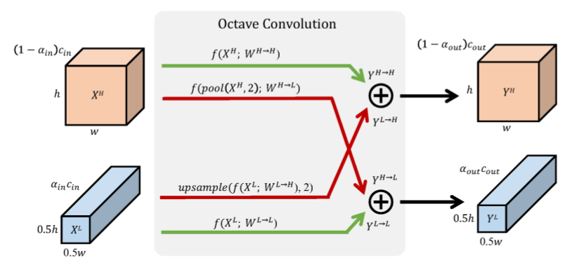
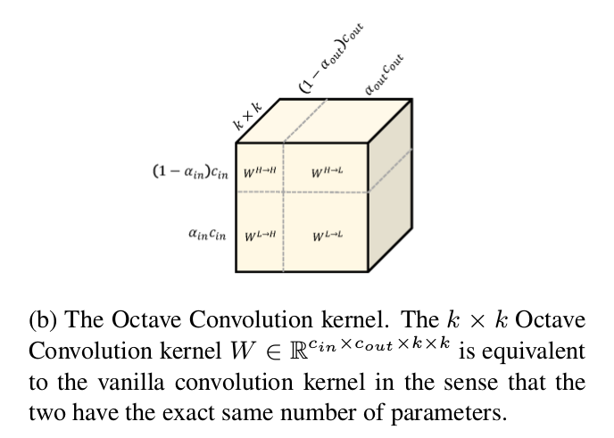
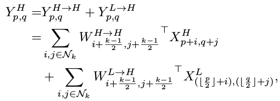
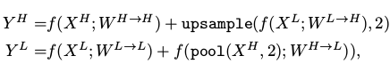

## Drop an Octave: Reducing Spatial Redundancy in Convolutional Neural Networks with Octave Convolution

### 作者

Yunpeng Chen

### 摘要

在自然图像中包含高频和低频两部分，其中高频通常编码细节信息、低频通常编码全局结构信息。同样可以将卷积层的输出特征图划分为高频和低频部分。在本文中，作者提出了一种根据频率对混合特征图进行特征化的方法，并设计了一种新的八音阶卷积操作，该操作将空间低频特征表示为低空间分辨率，降低了存储和计算消耗。OctConv是一个单个、通用、即插即用的模块，可以直接替代现有卷积方式而不用对网络结构进行调整。

### 内容

之前的高效网络结构的设计都集中在降低模型参数量、降低特征图通道冗余度上，但实际上，特征图的空间通道同样存在冗余，特征图的相邻位置之间存在共有的信息。类似于自然图像可以分解为表示平滑变化结构的低频空间频率和描述快速变化细节的高频部分，本文中提出了特征图的多频特征表示，将高频特征和低频特征存储于不同的分组中，该分组在特征图通道上进行。将特征图划分为高频和低频分组之后，因为低频图像的相邻位置之间存在共享信息，因此可以放心地将低频部分的空间分辨率降低，在降低空间冗余度的同时，降低计算复杂度。

本文的贡献如下：

1. 将卷积特征图划分为具有不同空间频率的分组，并使用与空间频率相关的不同的卷积核对各个分组进行处理。低频特征图空间分辨率的降低节省了存储和计算消耗。同时使得每一层获得更大的感受野，以捕捉更多的背景信息。
2. 设计了一个即插即用的卷积操作。
3. 所提出的OctConv可以获得明显的性能提升。

### 八音阶特征表示

为了降低特征图的空间冗余度，本文引入了八音阶特征表示方法**将特征图依据频率高低划分为高频和低频两个部分**。假设卷积层的输入特征图为$X \in R^{c\times h\times w}$，在通道维度将特征图划分为$X={X^H,X^L}$，其中高频部分为$X^H\in R^{(1-\alpha)c\times h\times w}$，低频部分为$X^L\in R^{\alpha c\times \frac{h}{2}\times \frac{w}{2}}$，其中$\alpha \in [0,1]$表示高频和低频部分占输入通道的比例，可以看出低频部分的空间分辨率减半。

### 八音阶卷积（OctConv）

设计八音阶卷积的目的有如下两个：

1. 在高频和低频各自相关的频率张量中，分别对高频和低频部分进行高效处理。
2. 使得八音阶特征表示的高频和低频部分之间能够进行有效的信息交流。

使用$X$和$Y$分别表示输入和输出特征，输出特征图$Y={Y^H, Y^L}$的高频部分可以表示为$Y^H=Y^{H \to H}+Y^{L \to H}$，低频部分表示为$Y^L=Y^{L \to L}+Y^{H \to L}$，其中$Y^{A \to B}$表示从特征图分组A到特征图分组B的卷积更新，$Y^{H \to H}$，$Y^{L \to L}$表示频率内部更新，$Y^{H \to L}$，$Y^{L \to H}$表示频率间更新，如下图所示。

上图中，绿色箭头表示频率内信息更新，红色箭头表示频率间信息更新。

为了计算上述四个项目，如上图所示，将卷积和划分为两部分$S=[W^H, W^L]$，分别表示输入特征的高频、低频两部分的卷积。每一部分可进一步划分为$W^H=[W^{H \to H}, W^{L \to H}]$，$W^L=[W^{L \to L}, W^{L=H \to H=L}]$。对于高频部分，位置$[p,q]$处，频率内的特征更新使用普通的卷积操作，而在进行频率间特征更新时，为了避免计算和存储上采样得到的特征图，将上采样操作融合进卷积操作中，如下式所示：

同样，对于低频部分，频率内卷积使用普通的卷积操作。对于频率间卷积，同样将下采样操作融合进卷积操作中。给p乘以2表示下采样操作，同时加上半个步长使得下采样图和输入相匹配。因为带步长的卷积会导致误匹配，因而使用平均池化得到近似值，如下式所示。

可以将卷积操作表示为下式：

可以看出低频部分由高频向低频的转换使用了池化操作，而非带步长的卷积，因为带步长的卷积会导致如下图所示的为知偏移。

上图中，首先使用步长为2的卷积将特征图的空间分辨率缩小为1/2，表示由高频向低频的变换，经过进一步卷积后得到低频部分的输出。紧接着，这一部分特征图将会在下一层中，经过上采样从低频变换至高频，本应在左上角的特征将会偏移至中心位置。

### 性能

如下图所示：

每一条曲线的黑色点表示原始的模型，横坐标表示FLOPS（log），纵坐标表示top-1准确率。通过调节比例$\alpha$可以在性能和模型大小之间进行权衡，在与原始模型性能持平的情况下，模型大小在50%左右，提升模型的大小，性能会超过原始模型的性能。可见，该卷积方式可以在保持甚至提升模型性能的情况下降低模型的大小。