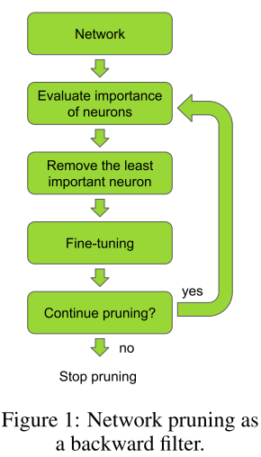
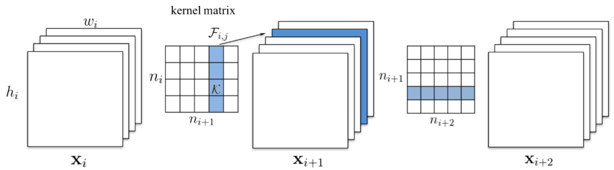
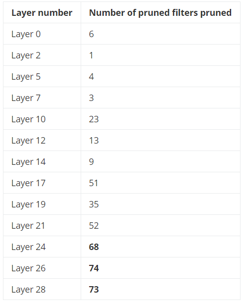

# Pruning Convolutional Neural Networks For Resource Efficient Inference

> 作者：Pavlo Molchanov, Stephen Tyree, Tero Karras, Timo Aila, Jan Kautz
>
> 机构：Nvidia

## 简介

在该方法中，使用迭代步骤进行剪枝：在基于准则的贪婪剪枝和使用反向传播进行微调两个步骤之间进行切换。作者提出了一种新的权重重要性度量准则-该准则**基于对网络参数进行剪枝所导致的损失函数变化的泰勒展开式**提出。作者将注意力集中在迁移学习上，将大的预训练网络调整到特定的任务。所提出的度量准则优于其他准则。

## 方法

在本文中提出的剪枝算法包含以下几步：

1. 对网络进行微调，直到网络在特定任务上收敛。
2. 在剪枝和微调两步之间进行迭代。
3. 在准确率和剪枝指标之间取得平衡后停止剪枝（FLOPS或者内存利用率）。

如下图所示：



剪枝流程很简单，但其成功应用依赖于使用正确的剪枝准则。在本节，我们将介绍一些有效的剪枝准则和相关技术。

考虑给定的训练样本$\mathcal{D}=\{\mathcal{X}=\left.\left\{\mathbf{x}_{0}, \mathbf{x}_{1}, \ldots, \mathbf{x}_{N}\right\}, \mathcal{Y}=\left\{y_{0}, y_{1}, \ldots, y_{N}\right\}\right\}$，其中$x$和$y$分别表示输入样本和目标变量。网络参数$\mathcal{W}=\left\{\left(\mathbf{w}_{1}^{1}, b_{1}^{1}\right),\left(\mathbf{w}_{1}^{2}, b_{1}^{2}\right), \ldots\left(\mathbf{w}_{L}^{C_{\ell}}, b_{L}^{C_{\ell}}\right)\right\}$被用于最小化损失值$\mathcal{C}(\mathcal{D} | \mathcal{W})$，常用的损失函数为负对数似然函数（$L(y)=-\log (y)$）。损失函数的选取与剪枝无关，只与网络所处理的任务有关。在迁移学习中，我们使用一个在类似但有区别的任务上训练的模型参数进行迁移。

在进行剪枝时，我们使用网络参数的子集来维持网络原有的准确率，即使得$\mathcal{C}\left(\mathcal{D} | \mathcal{W}^{\prime}\right) \approx \mathcal{C}(\mathcal{D} | \mathcal{W})$，为了达到这一目的，我们需要求解一个组合有优化问题：
$$
\min _{W^{\prime}}\left|\mathcal{C}\left(\mathcal{D} | \mathcal{W}^{\prime}\right)-\mathcal{C}(\mathcal{D} | \mathcal{W})\right| \text { s.t. } \quad\left\|\mathcal{W}^{\prime}\right\|_{0} \leq B
$$
上式中使用$L_0$范数来限制网络权重中非零参数的个数。对于上述问题，当$\mathcal{W}^{\prime}=\mathcal{W}$时，函数取得全局最小值，但由于约束条件的限制，一般无法取得这个值。

在参数空间中，查找足够好的参数子集使得损失函数的值尽可能地接近原始网络的损失值的问题属于组合优化问题。对于给定的数据，我们需要进行$2^{|\mathcal{W}|}$次评估来查找最优值。但是由于网络参数的个数过多，导致搜索空间太大，无法计算。在本文中，我们调查了一些贪婪方法。

给定参数集合，我们迭代地识别并移除最不重要的参数。在每次迭代中，保证参数数目满足约束条件的要求。

因为我们的目标集中在从卷积层中剪除特征图，因此将特征图的集合表示为：$\mathbf{z}_{\ell} \in \mathbb{R}^{H_{\ell} \times W_{\ell} \times C_{\ell}}$，其中$H_{\ell} \times W_{\ell}$表示特征图的大小，$C_{\ell}$表示独立特征图的个数（通道数）。特征图可以是网络的输入或者某一层卷积层的输出。$z_l$中$l \in[1,2,...,L]$。单个卷积图表示为$z_l^{(k)}$，其中$k\in[1,2,...,C_l]$。卷积层执行卷积核和输入特征图之间的卷积运算。
$$
\mathbf{z}_{\ell}^{(k)}=\mathbf{g}_{\ell}^{(k)} \mathcal{R}\left(\mathbf{z}_{\ell-1} * \mathbf{w}_{\ell}^{(k)}+b_{\ell}^{(k)}\right)
$$
其中$\mathbf{g}_{\ell}$为开关函数，决定一个特定的特征图是否在前向传播过程中被剪除或保留。

### Oracle Pruning

是否能最小化剪枝模型和全模型之间的准确率的差别取决于所使用的识别“最不重要”参数的准则。最优准则是对每一个参数进行经验评估，将其表示为oracle准则，**通过依次移除权重中的非零参数并记录损失的差别得到**。

我们对比了两种使用oracle重要性评估的方式：

1. *oracle-loss*：将重要性表示为损失函数变化值的符号：
   $$
   \mathcal{C}\left(\mathcal{D} | \mathcal{W}^{\prime}\right)-\mathcal{C}(\mathcal{D} | \mathcal{W})
   $$

2. oracle-abs：将重要性表示为损失函数变化值的绝对值：
   $$
   \left|\mathcal{C}\left(\mathcal{D} | \mathcal{W}^{\prime}\right)-\mathcal{C}(\mathcal{D} | \mathcal{W})\right|
   $$

两种评判方式都组织对可能导致损失增大的权重进行剪枝，不同之处在于：oracle-loss鼓励剪除那些被剪除后损失函数的值会减低的参数；而oracle-abs会惩罚那些可能会导致损失值发生变化的任何值，而不是变化的方向。

尽管oracle是贪婪搜索流程的最优选择，但是这一方法是非常耗时的。对于一个训练集，需要进行$\left\|W^{\prime}\right\|_{0}$次评估（对参数中的所有非零参数依次进行评估）。参数重要性的评估对于剪枝算法的准确率和效率都很重要，因而我们提出和评估了集中不同的准则。

### 剪枝准则

在本文中，我们对以下几种方法进行了评估，并提出了基于**泰勒展开式**的评估准则。

**最小权重**：依据权重的幅度移除卷积核可能是最简单的评价准则之一。在使用权重的范数进行剪枝的算法中，评估准则为：$\Theta_{M W} : \mathbb{R}^{C_{\ell-1} \times p \times p} \rightarrow \mathbb{R}$，其中$\Theta_{M W}(\mathbf{w})=\frac{1}{|\mathbf{w}|} \sum_{i} w_{i}^{2}$，$|\mathbf{w}|$为将权重向量化之后的维度。这一准则的出发点是具有较小二范数的权重的重要性低于具有较大二范数的权重。可以通过在训练过程中添加$l_1$、$l_2$正则项得到。

**激活值**：ReLU激活函数流行的原因之一是其会使得激活值变得稀疏，使得卷积层可以被当作一个特征检测器。因此我们可以假设：如果一个输入特征图的值很小的话，那么其对应的特征检测器将不是很重要。我们可以使用单个特征图的平均激活值进行度量：$\Theta_{MA}:\mathbb{R}^{H_{l} \times W_{\ell} \times \mathcal{C}_{\ell}} \rightarrow \mathbb{R}$，其中 $\Theta_{M A}(\mathbf{a})=\frac{1}{|\mathbf{a}|} \sum_{i} a_{i}$。或者使用激活值的标准差：$\Theta_{M A_{-} s t d}(\mathbf{a})=\sqrt{\frac{1}{|\mathbf{a}|} \sum_{i}\left(a_{i}-\mu_{\mathbf{a}}\right)^{2}}$。

**混合信息**：混合信息用来度量在一个变量中包含的另一个变量的信息量。可以使用混合信息来度量在某一激活值中所包含的目标的信息量，使用该信息量作为重要性的度量。因为混合信息定义在连续值上，因而可以使用信息增益进行替代。

**泰勒展开**：我们将剪枝问题视作最优化问题，尝试找到在非零参数个数受限的情况下使得$\left|\Delta \dot{C}\left(h_{i}\right)\right|=\left|\mathcal{C}\left(\mathcal{D} | \mathcal{W}^{\prime}\right)-\mathcal{C}(\mathcal{D} | \mathcal{W})\right|$最小化的参数子集$\mathcal{W}^{\prime}$。基于泰勒展开的方法，我们直接对由移除某个参数所导致的损失函数的变化值进行近似。设$h_i$表示参数$i$产生的输出。在特征图中，$h=\left\{z_{0}^{(1)}, z_{0}^{(2)}, \ldots, z_{L}^{\left(C_{\ell}\right)}\right\}$。为了表示方便，认为参数和参数对应的输出对损失函数的值所造成的影响是相同的：$\mathcal{C}\left(\mathcal{D} | h_{i}\right)=\mathcal{C}\left(\mathcal{D} |(\mathbf{w}, b)_{i}\right)$。假设参数之间互相独立：
$$
\left|\Delta \mathcal{C}\left(h_{i}\right)\right|=\left|\mathcal{C}\left(\mathcal{D}, h_{i}=0\right)-\mathcal{C}\left(\mathcal{D}, h_{i}\right)\right|（1）
$$
其中，$\mathcal{C}\left(\mathcal{D}, h_{i}=0\right)$表示将输出$h_i$剪除后损失函数的值，$\mathcal{C}\left(\mathcal{D}, h_{i}\right)$表示未剪除该输出时的损失函数的值。尽管参数之间并非相互独立，我们仍旧在每次参数更新时进行了独立性假设。

为了对损失函数的变化$\Delta \mathcal{C}\left(h_{i}\right)$的一阶泰勒展开对其进行近似。对于函数$f(x)$，其在$x=a$点的泰勒展开可以表示为：
$$
f(x)=\sum_{p=0}^{P} \frac{f^{(p)}(a)}{p !}(x-a)^{p}+R_{p}(x)
$$
其中$f^{(p)}(a)$为函数的$p$阶导数在$a$点的值，$R_p(x)$为$p$阶余项。将$C(D,h_i=0)$表示为函数在$h_i=0$点附近的一阶泰勒展开式。
$$
\mathcal{C}\left(\mathcal{D}, h_{i}=0\right)=\mathcal{C}\left(\mathcal{D}, h_{i}\right)-\frac{\delta \mathcal{C}}{\delta h_{i}} h_{i}+R_{1}\left(h_{i}=0\right)  （2）
$$
使用二阶拉格朗日余项：
$$
R_{1}\left(h_{i}=0\right)=\frac{\delta^{2} \mathcal{C}}{\delta\left(h_{i}^{2}=\xi\right)} \frac{h_{i}^{2}}{2}
$$
这里，我们直接忽略掉余项，一方面因为计算余项需要大量的计算资源（求二阶导数）；另一方面因为$ReLU$激活函数的原因，余项中的二阶项会比较小。

接着，将$(2)$式代入$(1)$式并忽略余项，可以得到$\Theta_{T E}:$$
\mathbb{R}^{H_{l} \times W_{l} \times \tilde{C}_{l}} \rightarrow \mathbb{R}^{+}
$：
$$
\Theta_{T E}\left(h_{i}\right)=\left|\Delta \mathcal{C}\left(h_{i}\right)\right|=\left|\mathcal{C}\left(\mathcal{D}, h_{i}\right)-\frac{\delta \mathcal{C}}{\delta h_{i}} h_{i}-\mathcal{C}\left(\mathcal{D}, h_{i}\right)\right|=\left|\frac{\delta \mathcal{C}}{\delta h_{i}} h_{i}\right|
$$
上式即可表示移除某一参数后对损失函数所造成的影响。在这一准则下，那些有较为平坦的梯度的特征图所对应的参数将被剪除。其中的梯度在反向传播过程中很容易计算得到。对于某个特征图,可以将上式转换为如下形式：
$$
\Theta_{T E}\left(z_{l}^{(k)}\right)=\left|\frac{1}{M} \sum_{m} \frac{\delta C}{\delta z_{l, m}^{(k)}} z_{l, m}^{(k)}\right|
$$
其中，$M$是向量化特征图的长度。对于一个minibatch的样本，分别针对每个样本计算上述值，再将各个样本的值进行平均。

## 相关博客

在VGG网络中，大部分的参数来自于全连接层，但全连接层的计算量只占所有浮点运算数的1%。对全连接层进行剪枝，会大幅度降低网络的参数量，但计算量并不会变化太多。而对卷积核进行剪枝不仅会降低参数量，也会大幅度降低运算量。

当对卷积核进行剪枝时，有一种操作是剪除每一个核中的一些权重，或者移除单个卷积核中的特定维度。这样，会得到稀疏的卷积核，但并不会起到加速计算的作用。因而，更多的工作集中在结构化剪枝 （移除整个卷积核）。

一些论文显示，通过对一个大的网络进行训练和剪枝，特别是迁移学习，会得到比直接从零开始训练一个小的网络更好的结果。

#### 论文-Pruning Filters For Efficient Convnets

在本文中，移除整个卷积核。移除第k个卷积核将导致其产生的特征图中的第k个通道消失，进而导致下一层的所有卷积核的第k个通道消失，如下图所示：



当下一层为全连接层时，假设被移除的通道的特征图大小为$M\times N$，那么全连接层中将有$M \times N$个神经元被移除。

在本文中，使用权重的$L1$范数对其进行分级。

#### 使用泰勒准则来对猫狗分类器进行剪枝

##### 第一步-训练一个大的网络

使用VGG16，移除全连接层，替换为三层新的全连接层。在训练过程中，冻结卷积层，只对新的全连接层进行训练。在Pytorch中，新的层如下：

```python
self.classifier = nn.Sequential(
	    nn.Dropout(),
	    nn.Linear(25088, 4096),
	    nn.ReLU(inplace=True),
	    nn.Dropout(),
	    nn.Linear(4096, 4096),
	    nn.ReLU(inplace=True),
	    nn.Linear(4096, 2))
```

使用数据增强训练20个epoches后，在测试集上得到98.7%的准确率。

##### 第二步-对卷积核进行分级

为了计算泰勒准则，我们需要在数据集上（如果数据集太大，可以使用一部分数据集）进行前向传播和反向传播（需要计算梯度）。

接着，我们需要同时得到军基层的梯度和激活值。在Pytorch中，我们可以在梯度计算中注册一个hook，所以在调用时便会完成相关计算：

```python
for layer, (name, module) in enumerate(self.model.features._modules.items()):
	x = module(x)
	if isinstance(module, torch.nn.modules.conv.Conv2d):
		x.register_hook(self.compute_rank)
		self.activations.append(x)
		self.activation_to_layer[activation_index] = layer
		activation_index += 1
```

这样，我们就使用`self.activations`保存了各层的激活值，当完成梯度的计算时，`compute_rank`函数便会被调用。

```python
def compute_rank(self, grad):
	activation_index = len(self.activations) - self.grad_index - 1
	activation = self.activations[activation_index]
	values = \
		torch.sum((activation * grad), dim = 0).\
			sum(dim=2).sum(dim=3)[0, :, 0, 0].data
	
	# Normalize the rank by the filter dimensions
	values = \
		values / (activation.size(0) * activation.size(2) * activation.size(3))

	if activation_index not in self.filter_ranks:
		self.filter_ranks[activation_index] = \
			torch.FloatTensor(activation.size(1)).zero_().cuda()

	self.filter_ranks[activation_index] += values
	self.grad_index += 1
```

这一函数对batch中的激活值和其梯度进行点乘，接着对于每一个激活值，在除了输出维度（特征图通道数）之外的所有维度进行求和。

例如，batch的大小为32，某一激活值的大小为256、空间大小为$112\times 112$，那么该激活值和其梯度的大小为$32\times 256 \times 112 \times 112$，那么其输出为大小为256的向量，向量的每一个元素表示该层中的256个卷积核各自的等级。

得到各个卷积核的等级之后，使用最小堆来得到$N$个等级最低的卷积核。和原始文章中在每一轮迭代中使用$N=1$不同，为了计算快速，我们使用$N=512$。这意味着，在每次剪枝迭代中，会移除$12%$的卷积核。

大多数被剪除的卷积核都来自于较深的层，在第一次迭代后被剪除的卷积核的分布：



##### 第三步-微调并重复

在这一步，解冻所有的层，并重新训练10个epochs。接着返回第一步并重复。

## 参考

* https://jacobgil.github.io/deeplearning/pruning-deep-learning